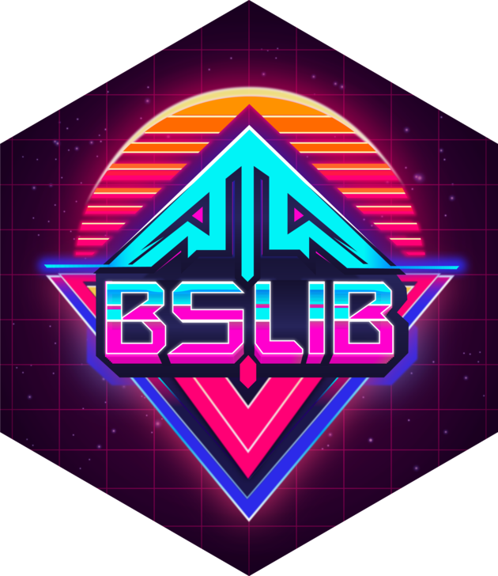

# bslib <a href='https://rstudio.github.io/bslib/'></a>


<!-- badges: start -->

[](https://cran.r-project.org/package=bslib)
[](https://rstudio.r-universe.dev/bslib)
[](https://github.com/rstudio/bslib/actions)

<!-- badges: end -->

```{r, include = FALSE}
knitr::opts_chunk$set(
  message = FALSE,
  collapse = TRUE,
  comment = "#>",
  fig.path = "man/figures/README-",
  out.width = "100%",
  fig.align = 'center'
)
library(bslib)
```

# bslib

The `bslib` R package provides a modern UI toolkit for [Shiny](https://shiny.posit.co/) and [R Markdown](https://rmarkdown.rstudio.com/) based on [Bootstrap](https://getbootstrap.com/). It facilitates:

* Creation of delightful and customizable [Shiny dashboards](https://rstudio.github.io/bslib/articles/dashboards.html).
  * The underlying UI components (e.g., [cards](https://rstudio.github.io/bslib/articles/cards.html), [value boxes](https://rstudio.github.io/bslib/articles/value-boxes.html), [sidebars](https://rstudio.github.io/bslib/articles/sidebars.html), etc) are also designed to work in other contexts (e.g., in R Markdown).
* [Custom theming](https://rstudio.github.io/bslib/articles/theming.html) of Shiny apps and R Markdown documents.
  * Apps can even be themed interactively in real-time.
* Use of modern versions of Bootstrap and [Bootswatch](https://bootswatch.com/)
  * Shiny and R Markdown currently default to Bootstrap 3 and may continue to do so to maintain backwards compatibility.

## Installation

Install the `bslib` package from CRAN as follows:

```r
install.packages("bslib")
```

## An example

The quickest way to see what `{bslib}` can do is to run `bslib::bs_theme_preview()` at the console. This launches a demo app containing both `{bslib}` and `{shiny}` UI components as well as an theming widget (`bslib::bs_themer()`) overlaid on the app. See [real-time theming](https://rstudio.github.io/bslib/articles/theming.html#real-time) to learn more.

```{r, echo = FALSE}
#| fig.alt: >
#|   An animation showing bslib theming app. As the user changes the Bootswatch
#|   theme and Bootstrap settings, the app's appearance changes in real-time.
knitr::include_graphics("vignettes/theming/themer.gif")
```

## Get started

Since `{bslib}` covers a wide array of uses, it has numerous getting started articles, each focusing on a particular interest:

* [Shiny dashboards](https://rstudio.github.io/bslib/articles/dashboards.html)
* [Any Bootstrap project](https://rstudio.github.io/bslib/articles/any-project.html)
* [Theming](https://rstudio.github.io/bslib/articles/theming.html)


## Getting help

There are two main places to get help with `bslib`:

+ The [RStudio community](https://forum.posit.co/) is a friendly place to ask any questions (be sure to add a `bslib` tag when creating a topic).

+ [Stack Overflow](https://stackoverflow.com/questions/tagged/bslib) is a great source of answers to common `bslib` questions. It is also a great place to get help, once you have created a reproducible example that illustrates your problem. Use the tags [`[r][bslib]`](https://stackoverflow.com/questions/tagged/bslib+r) if you ask a question. Add the tag `[bslib]` if you are using a Shiny runtime.

## Code of Conduct

Please note that the bslib project is released with a [Contributor Code of Conduct](https://github.com/rstudio/bslib/blob/main/CODE_OF_CONDUCT.md). By contributing to this project, you agree to abide by its terms.
