# Dashboards

This article focuses on using `bslib` to create the user interface (UI)
for [Shiny](https://shiny.posit.co/) dashboards. In the [next getting
started article](https://rstudio.github.io/bslib/articles/any-project),
we’ll also cover how these dashboard [components](#components), [layout
helpers](#layouts), etc. be also be used in isolation inside of any
Bootstrap project (e.g., R Markdown,
[pkgdown](https://pkgdown.r-lib.org/), etc), not just Shiny dashboards.

### Running examples

To run the Shiny app examples in this article, consider
copy/paste/run/edit the code in [this RStudio Cloud
project](https://posit.cloud/content/5603136).

## Hello dashboards

Quickly create a dashboard by providing a `title`, `sidebar`, and main
area contents to
[`page_sidebar()`](https://rstudio.github.io/bslib/reference/page_sidebar.md).

``` r
library(shiny)
library(bslib)

ui <- page_sidebar(
  title = "My dashboard",
  sidebar = "Sidebar",
  "Main content area"
)

shinyApp(ui, function(input, output) {})
```

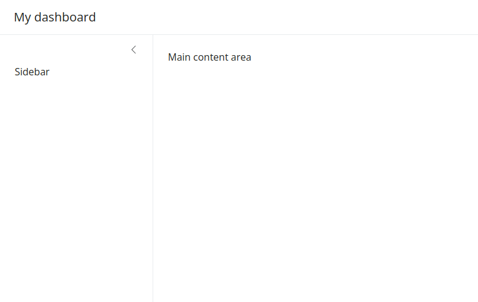

Both the `sidebar` and main content areas can hold any arbitrary
collection of UI elements, but it’s good practice to keep inputs in the
`sidebar` and outputs in the main content area. Also, consider wrapping
outputs in a
[`card()`](https://rstudio.github.io/bslib/reference/card.md) and
`sidebar` contents in a
[`sidebar()`](https://rstudio.github.io/bslib/reference/sidebar.md)
object to add a title and/or customize styling, positioning, etc.

Let’s start with a basic yet interesting example of a customizable
histogram with numeric variables from the
[palmerpenguins](https://allisonhorst.github.io/palmerpenguins/)
dataset.

``` r
library(ggplot2)
data(penguins, package = "palmerpenguins")

ui <- page_sidebar(
  title = "Penguins dashboard",
  sidebar = sidebar(
    title = "Histogram controls",
    varSelectInput(
      "var", "Select variable",
      dplyr::select_if(penguins, is.numeric)
    ),
    numericInput("bins", "Number of bins", 30)
  ),
  card(
    card_header("Histogram"),
    plotOutput("p")
  )
)

server <- function(input, output) {
  output$p <- renderPlot({
    ggplot(penguins) +
      geom_histogram(aes(!!input$var), bins = input$bins) +
      theme_bw(base_size = 20)
  })
}

shinyApp(ui, server)
```


Throughout the rest of this article, we’ll cover how to layout multiple
outputs, add multiple pages, and more. For that, it’ll be useful to have
some reusable outputs and inputs. So, let’s create a list of `cards`,
each with a
[`plotOutput()`](https://rdrr.io/pkg/shiny/man/plotOutput.html)
container for a numeric variable of interest, plus a `color_by` input
control to color the histograms by `species`, `island`, or `sex`.

``` r
cards <- list(
  card(
    full_screen = TRUE,
    card_header("Bill Length"),
    plotOutput("bill_length")
  ),
  card(
    full_screen = TRUE,
    card_header("Bill depth"),
    plotOutput("bill_depth")
  ),
  card(
    full_screen = TRUE,
    card_header("Body Mass"),
    plotOutput("body_mass")
  )
)

color_by <- varSelectInput(
  "color_by", "Color by",
  penguins[c("species", "island", "sex")],
  selected = "species"
)
```

Now, for a quick example, let’s pass `color_by` directly to `sidebar`
and the `cards` to the main content area. By default, each card is
placed in a new row, and the cards are allowed to grow/shrink to fit the
browser window (if the browser window is wide enough). In the next
section, we’ll cover how to customize the layout.

``` r
ui <- page_sidebar(
  title = "Penguins dashboard",
  sidebar = color_by,
  !!!cards
)

server <- function(input, output) {
  gg_plot <- reactive({
    ggplot(penguins) +
      geom_density(aes(fill = !!input$color_by), alpha = 0.2) +
      theme_bw(base_size = 16) +
      theme(axis.title = element_blank())
  })

  output$bill_length <- renderPlot(gg_plot() + aes(bill_length_mm))
  output$bill_depth <- renderPlot(gg_plot() + aes(bill_depth_mm))
  output$body_mass <- renderPlot(gg_plot() + aes(body_mass_g))
}

shinyApp(ui, server)
```

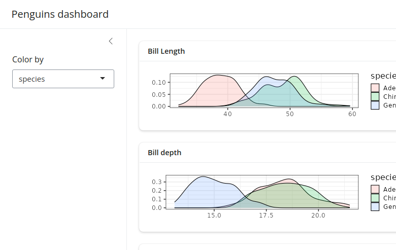

## Layouts

### Multi-column

Create multi-column layouts with
[`layout_columns()`](https://rstudio.github.io/bslib/reference/layout_columns.md).
If no `col_widths` are specified, it divides space evenly among the UI
elements in a row.

``` r
ui <- page_sidebar(
  title = "Penguins dashboard",
  sidebar = color_by,
  layout_columns(cards[[1]], cards[[2]]),
  cards[[3]]
)

shinyApp(ui, server)
```

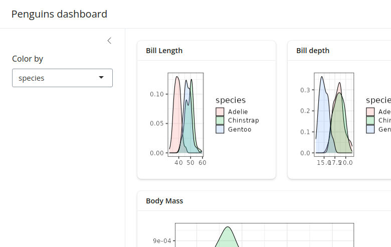

A vector of column widths may also be supplied to allocate a given
number of columns (out of 12) to each element. And, if elements go
beyond the 12 column mark, they get wrapped onto a new row. By default,
all row heights are equal, but this can be customized with the
`row_heights` argument (numeric values are interpreted as fractional
units, but fixed length units are also supported).

``` r
ui <- page_sidebar(
  title = "Penguins dashboard",
  sidebar = color_by,
  layout_columns(
    col_widths = c(4, 8, 12),
    row_heights = c(1, 2),
    cards[[1]],
    cards[[2]],
    cards[[3]]
  )
)

shinyApp(ui, server)
```

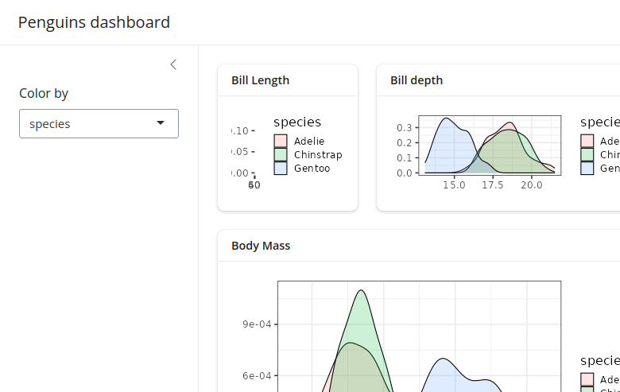

Negative `col_widths` may also be provided to easily create
negative/empty space:

``` r
ui <- page_sidebar(
  title = "Penguins dashboard",
  sidebar = color_by,
  layout_columns(
    col_widths = c(4, 8, -2, 8, -2),
    cards[[1]],
    cards[[2]],
    cards[[3]]
  )
)

shinyApp(ui, server)
```


Although we don’t show it here,
[`layout_columns()`](https://rstudio.github.io/bslib/reference/layout_columns.md)
also supports different `col_widths` and `row_heights` at different
[`breakpoints()`](https://rstudio.github.io/bslib/reference/breakpoints.md).
This is useful for creating responsive layouts that adapt to different
screen sizes. To learn more, visit
[`layout_columns()`](https://rstudio.github.io/bslib/reference/layout_columns.md).

### Multi-page

To add multiple pages, change
[`page_sidebar()`](https://rstudio.github.io/bslib/reference/page_sidebar.md)
to
[`page_navbar()`](https://rstudio.github.io/bslib/reference/page_navbar.md)
and use
[`nav_panel()`](https://rstudio.github.io/bslib/reference/nav-items.md)
to supply the title and content for each page. Here you can also take
advantage of `bslib`’s
[`nav_spacer()`](https://rstudio.github.io/bslib/reference/nav-items.md)
and
[`nav_item()`](https://rstudio.github.io/bslib/reference/nav-items.md)
to control the alignment and UI elements to the navbar (e.g., an
external hyperlink).

``` r
ui <- page_navbar(
  title = "Penguins dashboard",
  sidebar = color_by,
  nav_spacer(),
  nav_panel("Bill Length", cards[[1]]),
  nav_panel("Bill Depth", cards[[2]]),
  nav_panel("Body Mass", cards[[3]]),
  nav_item(tags$a("Posit", href = "https://posit.co"))
)

shinyApp(ui, server)
```

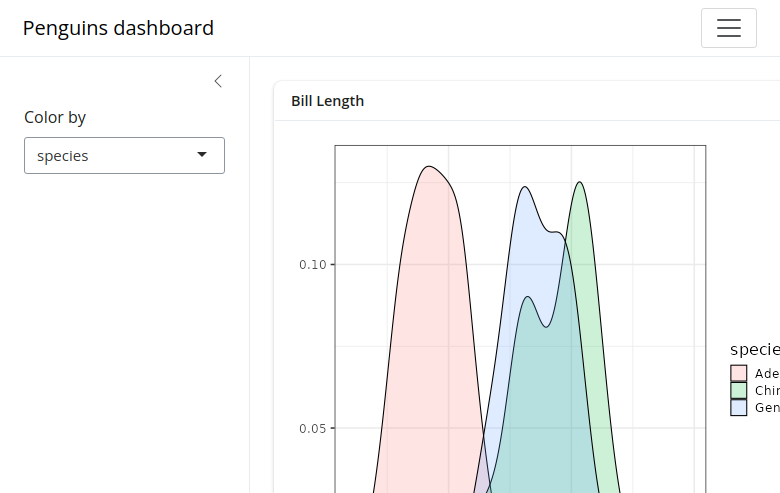

Be wary that
[`page_navbar()`](https://rstudio.github.io/bslib/reference/page_navbar.md)’s
`sidebar` argument puts the same sidebar on every page, which may or may
not be desirable. In the [sidebar
article](https://rstudio.github.io/bslib/articles/sidebars), you’ll
learn some strategies for keeping the sidebar’s contents close to the
elements they affect. Specifically, that article covers how to: (1)
[hide/show `sidebar` contents on particular
pages](https://rstudio.github.io/bslib/articles/sidebars/index.html#conditional-contents),
(2) [put a particular `sidebar()` with a given
page](https://rstudio.github.io/bslib/articles/sidebars/index.html#multi-page-example),
and even (3) [put sidebar layouts inside of a
`card()`](https://rstudio.github.io/bslib/articles/sidebars/index.html#multi-page-example).

### Multi-panel

Multiple
[`nav_panel()`](https://rstudio.github.io/bslib/reference/nav-items.md)s
don’t necessarily need to go directly into
[`page_navbar()`](https://rstudio.github.io/bslib/reference/page_navbar.md).
They can also be consumed by any `navset_*()` component, including
[`navset_card_underline()`](https://rstudio.github.io/bslib/reference/navset.md).

``` r
ui <- page_sidebar(
  title = "Penguins dashboard",
  sidebar = color_by,
  navset_card_underline(
    title = "Histograms by species",
    nav_panel("Bill Length", plotOutput("bill_length")),
    nav_panel("Bill Depth", plotOutput("bill_depth")),
    nav_panel("Body Mass", plotOutput("body_mass"))
  )
)

shinyApp(ui, server)
```

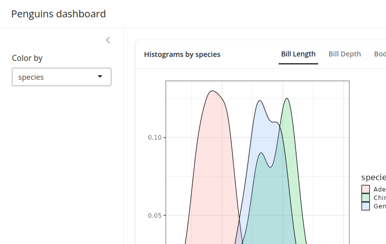

### Multi-panel layouts

[See
here](https://rstudio.github.io/bslib/reference/navset.html#details) to
learn more about multi-panel layout options.

### Scrolling vs filling

Both
[`page_sidebar()`](https://rstudio.github.io/bslib/reference/page_sidebar.md)
and
[`page_navbar()`](https://rstudio.github.io/bslib/reference/page_navbar.md)
default to a [filling
layout](https://rstudio.github.io/bslib/articles/filling), meaning that
outputs like
[`plotOutput()`](https://rdrr.io/pkg/shiny/man/plotOutput.html),
[htmlwidgets](https://github.com/ramnathv/htmlwidgets), etc. are
encouraged to grow/shrink to fit the browser window. As a result, when
contents have an large intrinsic minimum height (e.g., a long textual
description), filling layout may cause cards/outputs to grow/shrink
beyond what is desirable. To combat this, consider setting a `height` on
[`card()`](https://rstudio.github.io/bslib/reference/card.md)s that
shouldn’t grow/shrink and `min_height`/`max_height` on
[`card()`](https://rstudio.github.io/bslib/reference/card.md)s that
shouldn’t shrink/grow beyond a certain point.

``` r
ui <- page_sidebar(
  title = "Penguins dashboard",
  sidebar = color_by,
  card(min_height = 200, plotOutput("bill_length")),
  card(height = 200, lorem::ipsum(15))
)

shinyApp(ui, server)
```

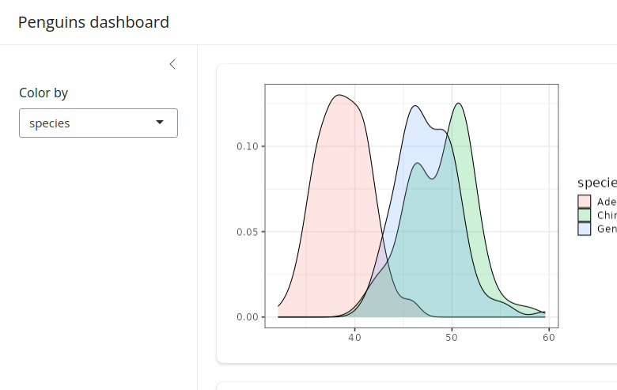

Filling layout may not be desirable when there are a lot of outputs to
display on a single page. In this case, consider setting
`fillable = FALSE` to prevent growing/shrinking altogether. When the
page layout is not `fillable`, outputs will fall back to their intrinsic
height, which is usually 400px. Users will be able to scroll the page if
the outputs take up more vertical space than the height of the window.

``` r
ui <- page_sidebar(
  title = "Penguins dashboard",
  sidebar = color_by,
  fillable = FALSE,
  !!!cards
)

shinyApp(ui, server)
```

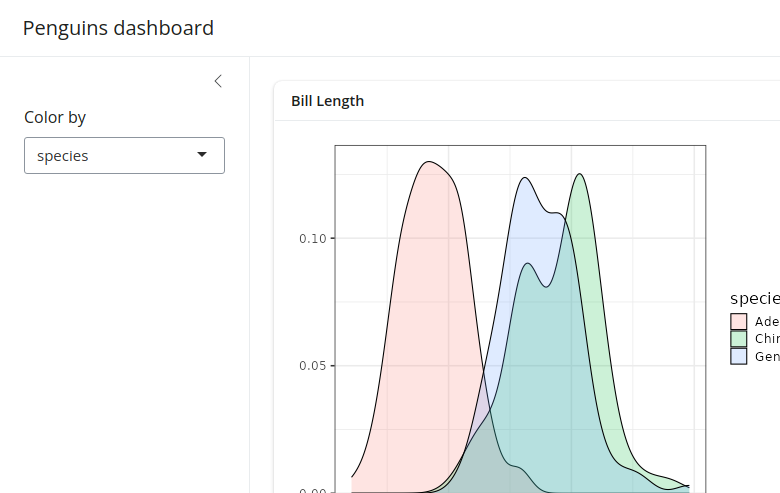

### A note on `page_navbar()`

Like
[`page_sidebar()`](https://rstudio.github.io/bslib/reference/page_sidebar.md),
[`page_navbar()`](https://rstudio.github.io/bslib/reference/page_navbar.md)
also has a `fillable` argument which also defaults to `TRUE`, which
makes *every* page (i.e.,
[`nav_panel()`](https://rstudio.github.io/bslib/reference/nav-items.md))
fillable. To make just a subset of pages fillable, pass a vector of page
names to `fillable` (e.g., `fillable = c("Bill Length", "Bill Depth")`).
To make *all* pages non-fillable, set `fillable = FALSE`.

### Mobile layout

By default, filling layout is not enabled on mobile devices, meaning
that `fillable` is effectively `FALSE` in that case. To enable filling
layout on mobile devices, set `fillable_mobile = TRUE`. In this case,
it’s good practice to set `min_height` on
[`card()`](https://rstudio.github.io/bslib/reference/card.md)s to
prevent them from growing/shrinking beyond what is desirable.

Also, sidebars are collapsed by default on mobile devices, but they can
be opened via
[`sidebar()`](https://rstudio.github.io/bslib/reference/sidebar.md)’s
`open` argument.

``` r
ui <- page_sidebar(
  title = "Penguins dashboard",
  sidebar = color_by,
  fillable_mobile = TRUE,
  card(min_height = 200, plotOutput("bill_length")),
  card(height = 200, lorem::ipsum(15))
)

shinyApp(ui, server)
```


## Components

### Value boxes

A
[`value_box()`](https://rstudio.github.io/bslib/reference/value_box.md)
is a special kind of card designed for highlighting a value along with a
title and a `showcase` placeholder (typically a
[bsicons](https://github.com/rstudio/bsicons) icon). They are covered in
more detail in the [value
boxes](https://rstudio.github.io/bslib/articles/value-boxes) article,
but here’s a
[palmerpenguins](https://allisonhorst.github.io/palmerpenguins/)
example:

``` r
means <- colMeans(
  penguins[c("bill_length_mm", "bill_depth_mm", "body_mass_g")],
  na.rm = TRUE
)

ui <- page_sidebar(
  title = "Penguins dashboard",
  sidebar = color_by,
  layout_columns(
    fill = FALSE,
    value_box(
      title = "Average bill length",
      value = scales::unit_format(unit = "mm")(means[[1]]),
      showcase = bsicons::bs_icon("align-bottom")
    ),
    value_box(
      title = "Average bill depth",
      value = scales::unit_format(unit = "mm")(means[[2]]),
      showcase = bsicons::bs_icon("align-center")
    ),
    value_box(
      title = "Average body mass",
      value = scales::unit_format(unit = "g", big.mark = ",")(means[[3]]),
      showcase = bsicons::bs_icon("handbag")
    )
  ),
  layout_columns(
    cards[[1]], cards[[2]]
  ),
  cards[[3]]
)

shinyApp(ui, server)
```

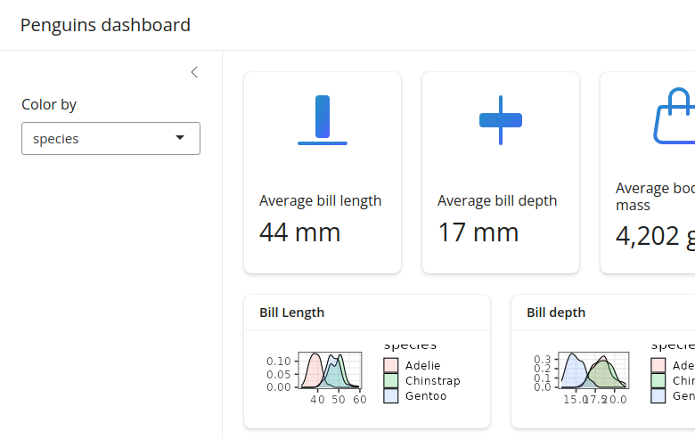

### Accordions

An
[`accordion()`](https://rstudio.github.io/bslib/reference/accordion.md)
uses vertical collapsing to provide scalable navigation through many
sections of content. Accordions can be placed anywhere on the page,
including to a `sidebar`, which is convenient for grouping sections of
input controls. Learn more about accordions on their [reference
page](https://rstudio.github.io/bslib/reference/accordion.html).

``` r
ui <- page_sidebar(
  title = "Penguins dashboard",

  sidebar = sidebar(
    bg = "white",
    accordion(
      accordion_panel(
        "Primary controls",
        color_by
      ),
      accordion_panel(
        "Other controls",
        "Other controls go here"
      )
    )
  ),

  accordion(
    open = c("Bill Length", "About"),
    accordion_panel(
      "Bill Length",
      plotOutput("bill_length")
    ),
    accordion_panel(
      "Bill Depth",
      plotOutput("bill_depth")
    ),
    accordion_panel(
      "Body Mass",
      plotOutput("body_mass")
    )
  )
)

shinyApp(ui, server)
```

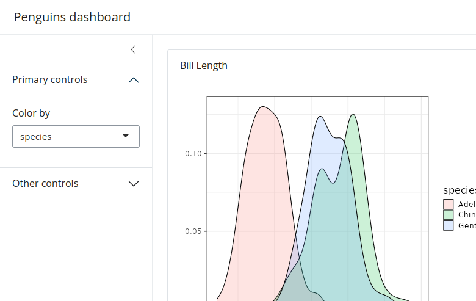

### Cards with sidebars

We’ve already seen how the `sidebar` argument of
[`page_sidebar()`](https://rstudio.github.io/bslib/reference/page_sidebar.md)
and
[`page_navbar()`](https://rstudio.github.io/bslib/reference/page_navbar.md)
yields a “page-level” sidebar layout, but they can also be made at the
“component-level” via
[`layout_sidebar()`](https://rstudio.github.io/bslib/reference/sidebar.md).
This is especially useful for keeping input controls near the outputs
they affect in more complex apps.
[`layout_sidebar()`](https://rstudio.github.io/bslib/reference/sidebar.md)
also works inside of a
[`card()`](https://rstudio.github.io/bslib/reference/card.md), making it
easy to add headers, footers, `full_screen` behavior, etc.

To learn more, visit the
[cards](https://rstudio.github.io/bslib/articles/cards) and
[sidebars](https://rstudio.github.io/bslib/articles/sidebars) articles.

``` r
ui <- page_sidebar(
  title = "Penguins dashboard",
  sidebar = sidebar(
    title = "Global controls",
    color_by
  ),
  card(
    full_screen = TRUE,
    card_header("Bill Length"),
    layout_sidebar(
      sidebar = sidebar(
        title = "Local controls",
        position = "right",
        "..."
      ),
      plotOutput("bill_length")
    )
  ),
  cards[[2]],
  cards[[3]],
)

shinyApp(ui, server)
```

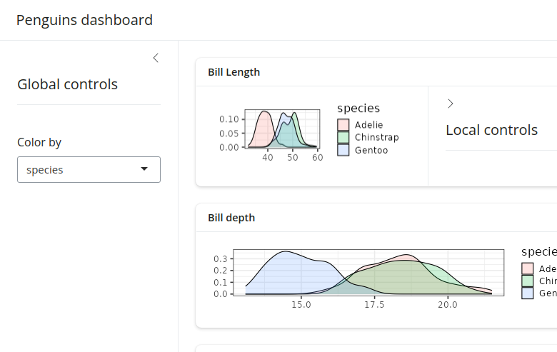

## Theming

In the getting started with [theming
article](https://rstudio.github.io/bslib/articles/theming), you’ll learn
some general theming strategies that also translate to dashboards. That
is, by passing a
[`bs_theme()`](https://rstudio.github.io/bslib/reference/bs_theme.md)
object to the `theme` argument of
[`page_sidebar()`](https://rstudio.github.io/bslib/reference/page_sidebar.md)
(or
[`page_navbar()`](https://rstudio.github.io/bslib/reference/page_navbar.md)),
we can add a [Bootswatch](https://bootswatch.com/) theme, easily use
[Google Fonts](https://fonts.google.com/), customize 100s of [theming
variables](https://rstudio.github.io/bslib/articles/bs5-variables), and
much more. Keep in mind, however, that
[`bs_theme()`](https://rstudio.github.io/bslib/reference/bs_theme.md)
only customizes CSS styles. So, if you want
[`plotOutput()`](https://rdrr.io/pkg/shiny/man/plotOutput.html)s to
match the CSS, consider using the
[thematic](https://rstudio.github.io/thematic/) package to translate the
styles to
[`ggplot2::theme()`](https://ggplot2.tidyverse.org/reference/theme.html)
settings. When doing so, also be aware that “complete”
[ggplot2](https://ggplot2.tidyverse.org) themes (e.g.,
[`theme_bw()`](https://ggplot2.tidyverse.org/reference/ggtheme.html))
only work sensibly when setting them globally (i.e.,
`theme_set(theme_bw())`).

``` r
ui <- page_sidebar(
  title = "Penguins dashboard",
  sidebar = color_by,
  theme = bs_theme(
    bootswatch = "darkly",
    base_font = font_google("Inter"),
    navbar_bg = "#25443B"
  ),
  !!!cards
)

# Enable thematic
thematic::thematic_shiny(font = "auto")

# Change ggplot2's default "gray" theme
theme_set(theme_bw(base_size = 16))

# New server logic (removes the `+ theme_bw()` part)
server <- function(input, output) {
  gg_plot <- reactive({
    ggplot(penguins) +
      geom_density(aes(fill = !!input$color_by), alpha = 0.2) +
      theme(axis.title = element_blank())
  })

  output$bill_length <- renderPlot(gg_plot() + aes(bill_length_mm))
  output$bill_depth <- renderPlot(gg_plot() + aes(bill_depth_mm))
  output$body_mass <- renderPlot(gg_plot() + aes(body_mass_g))
}

shinyApp(ui, server)
```

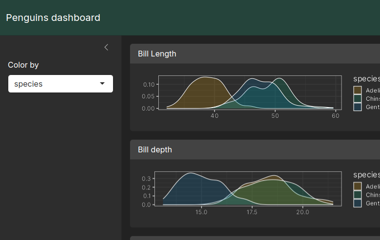

## In production

Before deploying a dashboard to production, it’s wise to “hard-code” the
version of Bootstrap used when it was developed. This reduces the chance
of the dashboard breaking if and when `bslib` updates its Bootstrap
dependency. To do so, call
[`version_default()`](https://rstudio.github.io/bslib/reference/versions.md)
to get the current version of Bootstrap, then pass that value to
`bs_theme(version = ...)` (and pass that theme object to the `theme`
argument of the relevant `page_*()` function).

``` r
library(shiny)

ui <- page_sidebar(
  theme = bs_theme(version = 5),
  ...
)

shinyApp(ui, function(...) {})
```
