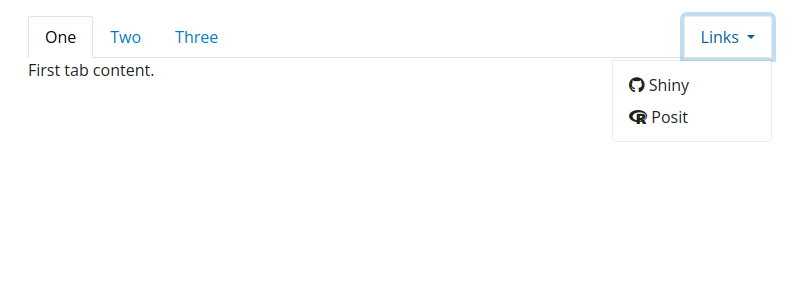

# Navigation containers

Render a collection of
[`nav_panel()`](https://rstudio.github.io/bslib/reference/nav-items.md)
items into a container.

## Usage

``` r
navset_tab(..., id = NULL, selected = NULL, header = NULL, footer = NULL)

navset_pill(..., id = NULL, selected = NULL, header = NULL, footer = NULL)

navset_underline(..., id = NULL, selected = NULL, header = NULL, footer = NULL)

navset_pill_list(
  ...,
  id = NULL,
  selected = NULL,
  header = NULL,
  footer = NULL,
  well = TRUE,
  fluid = TRUE,
  widths = c(4, 8)
)

navset_hidden(..., id = NULL, selected = NULL, header = NULL, footer = NULL)

navset_bar(
  ...,
  title = NULL,
  id = NULL,
  selected = NULL,
  sidebar = NULL,
  fillable = TRUE,
  gap = NULL,
  padding = NULL,
  header = NULL,
  footer = NULL,
  fluid = TRUE,
  navbar_options = NULL,
  position = deprecated(),
  bg = deprecated(),
  inverse = deprecated(),
  collapsible = deprecated()
)

navset_card_tab(
  ...,
  id = NULL,
  selected = NULL,
  title = NULL,
  sidebar = NULL,
  header = NULL,
  footer = NULL,
  height = NULL,
  full_screen = FALSE,
  wrapper = card_body
)

navset_card_pill(
  ...,
  id = NULL,
  selected = NULL,
  title = NULL,
  sidebar = NULL,
  header = NULL,
  footer = NULL,
  height = NULL,
  placement = c("above", "below"),
  full_screen = FALSE,
  wrapper = card_body
)

navset_card_underline(
  ...,
  id = NULL,
  selected = NULL,
  title = NULL,
  sidebar = NULL,
  header = NULL,
  footer = NULL,
  height = NULL,
  full_screen = FALSE,
  wrapper = card_body
)
```

## Arguments

- ...:

  a collection of
  [`nav_panel()`](https://rstudio.github.io/bslib/reference/nav-items.md)
  items.

- id:

  a character string used for dynamically updating the container (see
  [`nav_select()`](https://rstudio.github.io/bslib/reference/nav_select.md)).

- selected:

  a character string matching the `value` of a particular
  [`nav_panel()`](https://rstudio.github.io/bslib/reference/nav-items.md)
  item to selected by default.

- header:

  UI element(s)
  ([htmltools::tags](https://rstudio.github.io/htmltools/reference/builder.html))
  to display *above* the nav content. For `card`-based navsets, these
  elements are implicitly wrapped in a
  [`card_body()`](https://rstudio.github.io/bslib/reference/card_body.md).
  To control things like `padding`, `fill`, etc., wrap the elements in
  an explicit
  [`card_body()`](https://rstudio.github.io/bslib/reference/card_body.md).

- footer:

  UI element(s)
  ([htmltools::tags](https://rstudio.github.io/htmltools/reference/builder.html))
  to display *below* the nav content. For `card`-based navsets, these
  elements are implicitly wrapped in a
  [`card_body()`](https://rstudio.github.io/bslib/reference/card_body.md).
  To control things like `padding`, `fill`, etc., wrap the elements in
  an explicit
  [`card_body()`](https://rstudio.github.io/bslib/reference/card_body.md).

- well:

  `TRUE` to place a well (gray rounded rectangle) around the navigation
  list.

- fluid:

  `TRUE` to use fluid layout; `FALSE` to use fixed layout.

- widths:

  Column widths of the navigation list and tabset content areas
  respectively.

- title:

  A (left-aligned) title to place in the card header/footer. If
  provided, other nav items are automatically right aligned.

- sidebar:

  A [`sidebar()`](https://rstudio.github.io/bslib/reference/sidebar.md)
  component to display on every
  [`nav_panel()`](https://rstudio.github.io/bslib/reference/nav-items.md)
  page.

- fillable:

  Whether or not to allow `fill` items to grow/shrink to fit the browser
  window. If `TRUE`, all
  [`nav_panel()`](https://rstudio.github.io/bslib/reference/nav-items.md)
  pages are `fillable`. A character vector, matching the `value` of
  [`nav_panel()`](https://rstudio.github.io/bslib/reference/nav-items.md)s
  to be filled, may also be provided. Note that, if a `sidebar` is
  provided, `fillable` makes the main content portion fillable.

- gap:

  A [CSS length
  unit](https://rstudio.github.io/htmltools/reference/validateCssUnit.html)
  defining the `gap` (i.e., spacing) between elements provided to `...`.

- padding:

  Padding to use for the body. This can be a numeric vector (which will
  be interpreted as pixels) or a character vector with valid CSS
  lengths. The length can be between one and four. If one, then that
  value will be used for all four sides. If two, then the first value
  will be used for the top and bottom, while the second value will be
  used for left and right. If three, then the first will be used for
  top, the second will be left and right, and the third will be bottom.
  If four, then the values will be interpreted as top, right, bottom,
  and left respectively.

- navbar_options:

  Options to control the appearance and behavior of the navbar. Use
  [`navbar_options()`](https://rstudio.github.io/bslib/reference/navbar_options.md)
  to create the list of options.

- position:

  **\[deprecated\]** Please use
  [`navbar_options = navbar_options(position=)`](https://rstudio.github.io/bslib/reference/navbar_options.md)
  instead.

- bg:

  **\[deprecated\]** Please use
  [`navbar_options = navbar_options(bg=)`](https://rstudio.github.io/bslib/reference/navbar_options.md)
  instead.

- inverse:

  **\[deprecated\]** Please use
  [`navbar_options = navbar_options(inverse=)`](https://rstudio.github.io/bslib/reference/navbar_options.md)
  instead.

- collapsible:

  **\[deprecated\]** Please use
  [`navbar_options = navbar_options(collapsible=)`](https://rstudio.github.io/bslib/reference/navbar_options.md)
  instead.

- height:

  Any valid [CSS
  unit](https://rstudio.github.io/htmltools/reference/validateCssUnit.html)
  (e.g., `height="200px"`). Doesn't apply when a card is made
  `full_screen` (in this case, consider setting a `height` in
  [`card_body()`](https://rstudio.github.io/bslib/reference/card_body.md)).

- full_screen:

  If `TRUE`, an icon will appear when hovering over the card body.
  Clicking the icon expands the card to fit viewport size.

- wrapper:

  A function (which returns a UI element) to call on unnamed arguments
  in `...` which are not already card item(s) (like
  [`card_header()`](https://rstudio.github.io/bslib/reference/card_body.md),
  [`card_body()`](https://rstudio.github.io/bslib/reference/card_body.md),
  etc.). Note that non-card items are grouped together into one
  `wrapper` call (e.g. given `card("a", "b", card_body("c"), "d")`,
  `wrapper` would be called twice, once with `"a"` and `"b"` and once
  with `"d"`).

- placement:

  placement of the nav items relative to the content.

## Examples

### A basic example

This first example creates a simple tabbed navigation container with two
tabs. The tab name and the content of each tab are specified in the
[`nav_panel()`](https://rstudio.github.io/bslib/reference/nav-items.md)
calls and `navset_tab()` creates the tabbed navigation around these two
tabs.

    library(htmltools)

    navset_tab(
      nav_panel(title = "One", p("First tab content.")),
      nav_panel(title = "Two", p("Second tab content."))
    )


In the rest of the examples, we'll include links among the tabs (or
pills) in the navigation controls.

    link_shiny <- tags$a(shiny::icon("github"), "Shiny", href = "https://github.com/rstudio/shiny", target = "_blank")
    link_posit <- tags$a(shiny::icon("r-project"), "Posit", href = "https://posit.co", target = "_blank")

### `navset_tab()`

You can fully customize the controls in the navigation component. In
this example, we've added a direct link to the Shiny repository using
[`nav_item()`](https://rstudio.github.io/bslib/reference/nav-items.md).
We've also included a dropdown menu using
[`nav_menu()`](https://rstudio.github.io/bslib/reference/nav-items.md)
containing an option to select a third tab panel and another direct link
to Posit's website. Finally, we've separated the primary tabs on the
left from the direct link and dropdown menu on the right using
[`nav_spacer()`](https://rstudio.github.io/bslib/reference/nav-items.md).

    navset_tab(
      nav_panel(title = "One", p("First tab content.")),
      nav_panel(title = "Two", p("Second tab content.")),
      nav_panel(title = "Three", p("Third tab content")),
      nav_spacer(),
      nav_menu(
        title = "Links",
        nav_item(link_shiny),
        nav_item(link_posit)
      )
    )



### `navset_pill()`

`navset_pill()` creates a navigation container that behaves exactly like
`navset_tab()`, but the tab toggles are *pills* or button-shaped.

    navset_pill(
      nav_panel(title = "One", p("First tab content.")),
      nav_panel(title = "Two", p("Second tab content.")),
      nav_panel(title = "Three", p("Third tab content")),
      nav_spacer(),
      nav_menu(
        title = "Links",
        nav_item(link_shiny),
        nav_item(link_posit)
      )
    )


### `navset_underline()`

`navset_underline()` creates a navigation container that behaves exactly
like `navset_tab()` and `navset_pill()`, but the active/focused
navigation links are styled with an underline.

    navset_underline(
      nav_panel(title = "One", p("First tab content.")),
      nav_panel(title = "Two", p("Second tab content.")),
      nav_panel(title = "Three", p("Third tab content")),
      nav_spacer(),
      nav_menu(
        title = "Links",
        nav_item(link_shiny),
        nav_item(link_posit)
      )
    )


### `navset_card_tab()`

The tabbed navigation container can also be used in a
[`card()`](https://rstudio.github.io/bslib/reference/card.md) component
thanks to `navset_card_tab()`. Learn more about this approach in the
[article about
Cards](https://pkgs.rstudio.com/bslib/articles/cards.html), including
how to add [a shared
sidebar](https://pkgs.rstudio.com/bslib/articles/sidebars.html#multi-page-layout)
to all tabs in the card using the `sidebar` argument of
`navset_card_tab()`.

    navset_card_tab(
      nav_panel(title = "One", p("First tab content.")),
      nav_panel(title = "Two", p("Second tab content.")),
      nav_panel(title = "Three", p("Third tab content")),
      nav_spacer(),
      nav_menu(
        title = "Links",
        nav_item(link_shiny),
        nav_item(link_posit)
      )
    )


### `navset_card_pill()`

Similar to `navset_pill()`, `navset_card_pill()` provides a pill-shaped
variant to `navset_card_tab()`. You can use the `placement` argument to
position the navbar `"above"` or `"below"` the card body.

    navset_card_pill(
      placement = "above",
      nav_panel(title = "One", p("First tab content.")),
      nav_panel(title = "Two", p("Second tab content.")),
      nav_panel(title = "Three", p("Third tab content")),
      nav_spacer(),
      nav_menu(
        title = "Links",
        nav_item(link_shiny),
        nav_item(link_posit)
      )
    )


### `navset_card_underline()`

`navset_card_underline()` provides a card-based variant of
`navset_underline()`.

    navset_card_underline(
      nav_panel(title = "One", p("First tab content.")),
      nav_panel(title = "Two", p("Second tab content.")),
      nav_panel(title = "Three", p("Third tab content")),
      nav_spacer(),
      nav_menu(
        title = "Links",
        nav_item(link_shiny),
        nav_item(link_posit)
      )
    )


### `navset_pill_list()`

Furthermore, `navset_pill_list()` creates a vertical list of navigation
controls adjacent to, rather than on top of, the tab content panels.

    navset_pill_list(
      nav_panel(title = "One", p("First tab content.")),
      nav_panel(title = "Two", p("Second tab content.")),
      nav_panel(title = "Three", p("Third tab content")),
      nav_spacer(),
      nav_menu(
        title = "Links",
        nav_item(link_shiny),
        nav_item(link_posit)
      )
    )


### [`page_navbar()`](https://rstudio.github.io/bslib/reference/page_navbar.md)

Finally,
[`page_navbar()`](https://rstudio.github.io/bslib/reference/page_navbar.md)
provides full-page navigation container similar to `navset_underline()`
but where each
[`nav_panel()`](https://rstudio.github.io/bslib/reference/nav-items.md)
is treated as a full page of content and the navigation controls appear
in a top-level navigation bar. Note that the navbar background and
underline styling can be controlled via `navbar_options`.

[`page_navbar()`](https://rstudio.github.io/bslib/reference/page_navbar.md)
is complimented by `navset_bar()` which produces a similar layout
intended to be used within an app.

    page_navbar(
      title = "My App",
      navbar_options = navbar_options(
        bg = "#0062cc",
        underline = TRUE
      ),
      nav_panel(title = "One", p("First tab content.")),
      nav_panel(title = "Two", p("Second tab content.")),
      nav_panel(title = "Three", p("Third tab content")),
      nav_spacer(),
      nav_menu(
        title = "Links",
        align = "right",
        nav_item(link_shiny),
        nav_item(link_posit)
      )
    )


## See also

[`nav_panel()`](https://rstudio.github.io/bslib/reference/nav-items.md),
[`nav_panel_hidden()`](https://rstudio.github.io/bslib/reference/nav-items.md)
create panels of content.

[`nav_menu()`](https://rstudio.github.io/bslib/reference/nav-items.md),
[`nav_item()`](https://rstudio.github.io/bslib/reference/nav-items.md),
[`nav_spacer()`](https://rstudio.github.io/bslib/reference/nav-items.md)
create menus, items, or space in the navset control area.

[`nav_insert()`](https://rstudio.github.io/bslib/reference/nav_select.md),
[`nav_remove()`](https://rstudio.github.io/bslib/reference/nav_select.md)
programmatically add or remove nav panels.

[`nav_select()`](https://rstudio.github.io/bslib/reference/nav_select.md),
[`nav_show()`](https://rstudio.github.io/bslib/reference/nav_select.md),
[`nav_hide()`](https://rstudio.github.io/bslib/reference/nav_select.md)
change the state of a
[`nav_panel()`](https://rstudio.github.io/bslib/reference/nav-items.md)
in a navset.

Other Panel container functions:
[`nav-items`](https://rstudio.github.io/bslib/reference/nav-items.md),
[`nav_select()`](https://rstudio.github.io/bslib/reference/nav_select.md)
