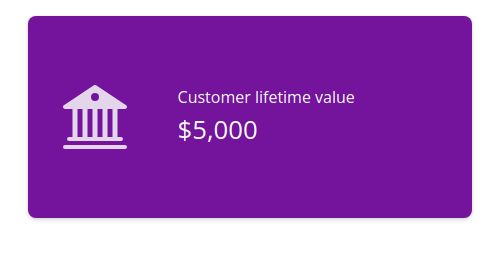

# Value box

An opinionated
([`card()`](https://rstudio.github.io/bslib/reference/card.md)-powered)
box, designed for displaying a `value` and `title`. Optionally, a
`showcase` can provide for context for what the `value` represents (for
example, it could hold a
[`bsicons::bs_icon()`](https://rdrr.io/pkg/bsicons/man/bs_icon.html), or
even a
[`shiny::plotOutput()`](https://rdrr.io/pkg/shiny/man/plotOutput.html)).
Find examples and template code you can use to create engaging [value
boxes on the bslib
website](https://rstudio.github.io/bslib/articles/value-boxes/index.html).

## Usage

``` r
value_box(
  title,
  value,
  ...,
  showcase = NULL,
  showcase_layout = c("left center", "top right", "bottom"),
  full_screen = FALSE,
  theme = NULL,
  height = NULL,
  max_height = NULL,
  min_height = NULL,
  fill = TRUE,
  class = NULL,
  id = NULL,
  theme_color = deprecated()
)

value_box_theme(name = NULL, bg = NULL, fg = NULL)

showcase_left_center(
  width = 0.3,
  width_full_screen = "1fr",
  max_height = "100px",
  max_height_full_screen = 0.67
)

showcase_top_right(
  width = 0.4,
  width_full_screen = "1fr",
  max_height = "75px",
  max_height_full_screen = 0.67
)

showcase_bottom(
  width = "100%",
  width_full_screen = NULL,
  height = "auto",
  height_full_screen = "2fr",
  max_height = "100px",
  max_height_full_screen = NULL
)
```

## Arguments

- title, value:

  A string, number, or
  [`htmltools::tag()`](https://rstudio.github.io/htmltools/reference/builder.html)
  child to display as the title or value of the value box. The `title`
  appears above the `value`.

- ...:

  Unnamed arguments may be any
  [`htmltools::tag()`](https://rstudio.github.io/htmltools/reference/builder.html)
  children to display below `value`. Named arguments become attributes
  on the containing element.

- showcase:

  A
  [`htmltools::tag()`](https://rstudio.github.io/htmltools/reference/builder.html)
  child to showcase (e.g., a
  [`bsicons::bs_icon()`](https://rdrr.io/pkg/bsicons/man/bs_icon.html),
  a
  [`plotly::plotlyOutput()`](https://rdrr.io/pkg/plotly/man/plotly-shiny.html),
  etc).

- showcase_layout:

  One of `"left center"` (default), `"top right"` or `"bottom"`.
  Alternatively, you can customize the showcase layout options with the
  `showcase_left_center()`, `showcase_top_right()`, or
  `showcase_bottom()` functions. Use the options functions when you want
  to control the height or width of the showcase area.

- full_screen:

  If `TRUE`, an icon will appear when hovering over the card body.
  Clicking the icon expands the card to fit viewport size.

- theme:

  The name of a theme for the value box, or a theme constructed with
  `value_box_theme()`. The theme names provide a convenient way to use
  your app's Bootstrap theme colors as the foreground or background
  colors of the value box. See below for more details on the provided
  themes. For more control, you can create your own theme with
  `value_box_theme()` where you can pass foreground and background
  colors directly. See the **Themes** section for more details.

- max_height:

  The maximum height of the `value_box()` or the showcase area when used
  in a `showcase_layout_*()` function. Can be any valid [CSS
  unit](https://rstudio.github.io/htmltools/reference/validateCssUnit.html)
  (e.g., `max_height="200px"`).

- min_height:

  The minimum height of the values box. Can be any valid [CSS
  unit](https://rstudio.github.io/htmltools/reference/validateCssUnit.html)
  (e.g., `min_height="200px"`).

- fill:

  Whether to allow the value box to grow/shrink to fit a fillable
  container with an opinionated height (e.g.,
  [`page_fillable()`](https://rstudio.github.io/bslib/reference/page_fillable.md)).

- class:

  Utility classes for customizing the appearance of the summary card.
  Use `bg-*` and `text-*` classes (e.g, `"bg-danger"` and
  `"text-light"`) to customize the background/foreground colors.

- id:

  Provide a unique identifier for the
  [`card()`](https://rstudio.github.io/bslib/reference/card.md) or
  `value_box()` to report its full screen state to Shiny. For example,
  using `id = "my_card"`, you can observe the card's full screen state
  with `input$my_card_full_screen`.

- theme_color:

  **\[deprecated\]** Use `theme` instead.

- name:

  The name of the theme, e.g. `"primary"`, `"danger"`, `"purple"`.

- bg, fg:

  The background and foreground colors for the theme. If only `bg` is
  provided, then the foreground color is automatically chosen from
  `$black` or `$white` to provide the best contrast with the background
  color.

- width, width_full_screen, height, height_full_screen:

  one of the following:

  - A proportion (i.e., a number between 0 and 1) of available width or
    height to allocate to the showcase.

  - A valid [CSS
    unit](https://rstudio.github.io/htmltools/reference/validateCssUnit.html)
    defining the width or height of the showcase column, or a valid
    value accepted by the `grid-template-columns` (width) or
    `grid-template-rows` (height) CSS property to define the width or
    height of the showcase column or row. Accepted values in the second
    category are `"auto"`, `"min-content"`, `"max-content"`, a
    fractional unit (e.g. `2fr`), or a `minmax()` function (e.g.,
    `minmax(100px, 1fr)`).

- max_height_full_screen:

  A proportion (i.e., a number between 0 and 1) or any valid [CSS
  unit](https://rstudio.github.io/htmltools/reference/validateCssUnit.html)
  defining the showcase `max_height` in a full screen card.

## Build-a-Box App

Explore all of the `value_box()` options and layouts interactively with
the [Build-a-Box app](https://bslib.shinyapps.io/build-a-box/),
available online thanks to [shinyapps.io](https://www.shinyapps.io/).
Or, you can run the app locally with:

    # shiny >= 1.8.1
    shiny::runExample("build-a-box", package = "bslib")

    # shiny < 1.8.1
    shiny::runApp(system.file("examples-shiny", "build-a-box", package = "bslib"))

## Themes

The appearance of a `value_box()` can be controlled via the `theme`
argument in one of two ways:

1.  a character value describing the theme, such as `theme = "primary"`
    or `theme = "blue"`; or

2.  `theme = value_box_theme()` to create a custom theme.

We recommend using named themes for most value boxes (the first
approach), because these themes will automatically match your Bootstrap
theme.

### Named themes

Bootstrap provides a list of [theme
colors](https://getbootstrap.com/docs/5.3/customize/color/#theme-colors),
with semantic names like `"primary"`, `"secondary"`, `"success"`,
`"danger"`, etc. You can set `theme` to one of these names to use the
corresponding theme color as the background color of your value box.

    value_box(
      title = "Customer lifetime value",
      value = "$5,000",
      showcase = bsicons::bs_icon("bank2"),
      theme = "primary"
    )


Bootstrap's theme colors are drawn from [a second color
list](https://getbootstrap.com/docs/5.3/customize/color/#all-colors)
that includes variations on several main colors, named literally. These
colors include `"blue"`, `"purple"`, `"pink"`, `"red"`, `"orange"`,
`"yellow"`, `"green"`, `"teal"`, and `"cyan"`.

    value_box(
      title = "Customer lifetime value",
      value = "$5,000",
      showcase = bsicons::bs_icon("bank2"),
      theme = "teal"
    )


### Background colors

If the theme or color name is provided without any prefix, the color
will be used for the background of the value box. You can also
explicitly prefix the theme or color name with `bg-` to indicate that it
should apply to the value box background. When the theme sets the
background color, either black or white is chosen automatically for the
text color using Bootstrap's color contrast algorithm.

As before, you can reference semantic theme color names or literal color
names.

    value_box(
      title = "Customer lifetime value",
      value = "$5,000",
      showcase = bsicons::bs_icon("bank2"),
      theme = "bg-success"
    )


    value_box(
      title = "Customer lifetime value",
      value = "$5,000",
      showcase = bsicons::bs_icon("bank2"),
      theme = "bg-purple"
    )


### Foreground colors

To set only the foreground colors of the value box, you can prefix the
theme or color name with `text-`. This changes the text color without
affecting the background color.

    value_box(
      title = "Customer lifetime value",
      value = "$5,000",
      showcase = bsicons::bs_icon("bank2"),
      theme = "text-success"
    )


    value_box(
      title = "Customer lifetime value",
      value = "$5,000",
      showcase = bsicons::bs_icon("bank2"),
      theme = "text-purple"
    )


Occasionally you may want to adjust use both background and foreground
themes on your value box. To achieve this, set `theme` to one of the
theme names and use `class` for the complementary style. The example
below uses `theme = "purple"` (which could also be `"bg-purple"`) for a
purple background, and `class = "text-light"` for light-colored text.

    value_box(
      title = "Customer lifetime value",
      value = "$5,000",
      showcase = bsicons::bs_icon("bank2"),
      theme = "purple",
      class = "text-light"
    )



### Gradient backgrounds

For a vibrant and attention-grabbing effect, bslib provides an array of
gradient background options. Provide `theme` with a theme name in the
form `bg-gradient-{from}-{to}`, where `{from}` and `{to}` are named main
colors, e.g. `bg-gradient-indigo-blue`.

    value_box(
      title = "Customer lifetime value",
      value = "$5,000",
      showcase = bsicons::bs_icon("bank2"),
      theme = "bg-gradient-indigo-blue"
    )


### Custom colors

Finally, for complete customization, you can use `value_box_theme()` to
create a custom theme. This function takes arguments `bg` and `fg` to
set the background and foreground colors, respectively. Like with the
`bg-` theme names, if only `bg` is provided, `value_box_theme()` will
choose an appropriate light or dark color for the text color.

    value_box(
      title = "Customer lifetime value",
      value = "$5,000",
      showcase = bsicons::bs_icon("bank2"),
      theme = value_box_theme(bg = "#e6f2fd", fg = "#0B538E"),
      class = "border"
    )


Note that `value_box_theme()` optionally takes a `theme` name, which can
be helpful if you want to use a named theme and modify the default `bg`
or `fg` colors of that theme.

    value_box_theme(name = "orange", bg = "#FFFFFF")
    value_box_theme(name = "text-danger", fg = "#FFB6C1")

Also note that `bg`/`fg` *must* be CSS colors, not Bootstrap theme or
color names. This means that `theme = "purple"` will use your Bootstrap
theme's purple color, and `bg = "purple"` will use the CSS color for
*purple*, i.e. `"#800080"`.

## Showcase Layouts

Use the `showcase` argument to add a plot or icon to your `value_box()`.
There are three layouts available: `"left center"`, `"top right"`, and
`"bottom"`. Set `showcase` to the name of the layout you'd like, or use
the `showcase_left_center()`, `showcase_top_right()`, or
`showcase_bottom()` helper functions to customize the showcase area's
size.

If you're using a plot as your showcase, you may also want to set
`fullscreen = TRUE` so that your users can expand the value box into a
full screen card. See the [value box
article](https://rstudio.github.io/bslib/articles/value-boxes/index.html)
for more details.

### Left-center showcase

The `"left center"` showcase layout is the default, and is perfect for
an icon or a small plot. This layout works best for short value boxes.

    value_box(
      title = "Energy consumption",
      value = "345 kwh/month",
      showcase = bsicons::bs_icon("ev-station-fill")
    )


### Top-right showcase

The `"top right"` showcase layout places the icon or plot in the upper
right corner of the value box. This layout works best for medium-height
to square value boxes.

    value_box(
      title = "Energy consumption",
      value = "345 kwh/month",
      showcase = bsicons::bs_icon("ev-station-fill"),
      showcase_layout = "top right"
    )


### Bottom showcase

Finally, the `"bottom"` showcase layout is perfect for full-bleed plots.
This layout places the plot below the title and value, with the plot
taking up the full width of the bottom half.

Try this layout with sparkline-style plots. These can be a little tricky
to set up, so be sure to check out the [Expandable
sparklines](https://rstudio.github.io/bslib/articles/value-boxes/index.html#expandable-sparklines)
section of the [value boxes
article](https://rstudio.github.io/bslib/articles/value-boxes/index.html)
on the bslib website. In this example, we've created a sparkline plot
using base R graphics, which isn't generally recommended.

Code for a sparkline plot with base R

  

    set.seed(4242)

    random_sparkline_plot <- function() {
      timeseries <- cumsum(runif(100, -2, 2))
      x_axis <- seq_along(timeseries)
      x_lim <- c(1, length(timeseries))
      y_lim <- range(timeseries) + c(-2, 0)

      par(mar = c(0, 0, 0, 0))

      # Set up the plot area
      plot(
        timeseries, type = "n",
        axes = FALSE, frame.plot = FALSE,
        ylim = y_lim, xlim = x_lim,
        ylab = "",    xlab = "",
        yaxs = "i",   xaxs = "i",
      )

      # Add the sparkline line
      lines(timeseries, type = "l", pch = NA, col = "#0B538E", lwd = 3)

      # Create polygon coordinates for shading
      polygon_x <- c(1, x_axis, length(timeseries))
      polygon_y <- c(min(y_lim), timeseries, min(y_lim))

      # Add shading under the line
      polygon(polygon_x, polygon_y, col = "#e6f2fd", border = NA)
    }

    sparkline_plot <- function() {
      as_fill_item(
        htmltools::plotTag(
          random_sparkline_plot(),
          width = 500,
          height = 125,
          suppressSize = "xy",
          alt = paste(
            "A sparkline plot with a randomly-generated timeseries.",
            "The timeseries starts high and ends low, with lots of variation."
          )
        )
      )
    }

    value_box(
      title = "Energy consumption",
      value = "345 kwh/month",
      showcase = sparkline_plot(),
      showcase_layout = "bottom"
    )


## References

Value boxes are featured on the bslib website in a few articles:

- [Value
  boxes](https://rstudio.github.io/bslib/articles/value-boxes/index.html)

- [Build-a-Box App](https://bslib.shinyapps.io/build-a-box)

- [Get Started:
  Dashboards](https://rstudio.github.io/bslib/articles/dashboards/index.html#value-boxes)

## See also

Value boxes are a specialized form of a
[`card()`](https://rstudio.github.io/bslib/reference/card.md) component.

[`layout_columns()`](https://rstudio.github.io/bslib/reference/layout_columns.md)
and
[`layout_column_wrap()`](https://rstudio.github.io/bslib/reference/layout_column_wrap.md)
help position multiple value boxes into columns and rows.

Other Components:
[`accordion()`](https://rstudio.github.io/bslib/reference/accordion.md),
[`card()`](https://rstudio.github.io/bslib/reference/card.md),
[`popover()`](https://rstudio.github.io/bslib/reference/popover.md),
[`tooltip()`](https://rstudio.github.io/bslib/reference/tooltip.md)

## Examples

``` r
if (FALSE) { # rlang::is_interactive()
library(htmltools)

value_box(
  "KPI Title",
  h1(HTML("$1 <i>Billion</i> Dollars")),
  span(
    bsicons::bs_icon("arrow-up"),
    " 30% VS PREVIOUS 30 DAYS"
  ),
  showcase = bsicons::bs_icon("piggy-bank"),
  theme = "success"
)
}
```
