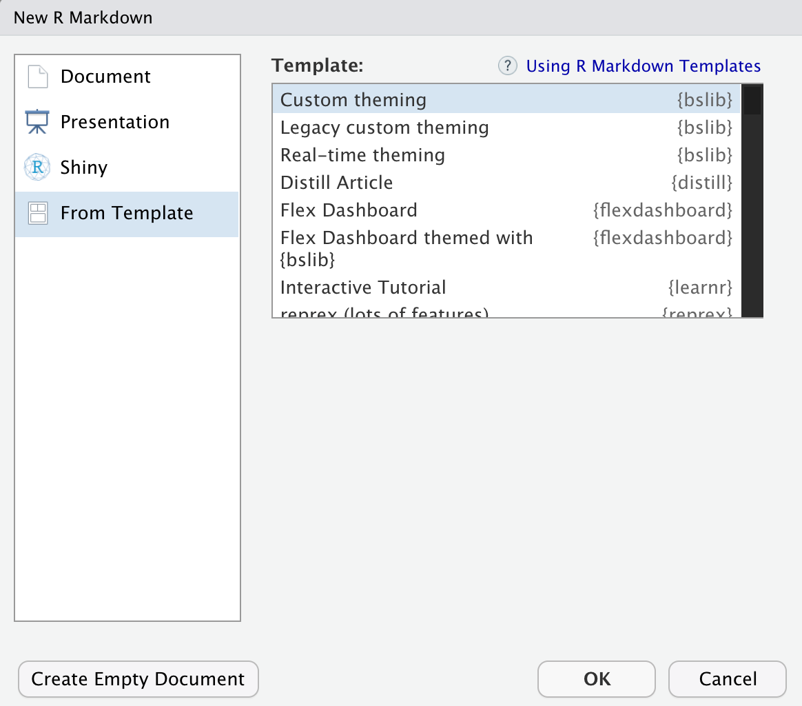

```{r setup, include=FALSE}
source(
  rprojroot::find_package_root_file("vignettes/articles/_common.R")
)
```

```{css, echo=FALSE}
.plotly {
  .modebar-container {display: none};
}
.section.level2 {
  margin-top: 3rem;
}
.section.level3 {
  margin-top: 2rem;
}
```

```{scss, echo = FALSE}
@media (min-width: 800px) {
  .usage {
    display: grid;
    grid-template-columns: 1fr 1fr;
    gap: 0.5rem;
    align-items: center;
  }
}
```


In addition to providing components for [Shiny dashboards](../dashboards), `bslib` can also provide the Bootstrap dependency for any compatible R project (e.g., Shiny, R Markdown, crosstalk, etc). When doing so, you not only upgrade the Bootstrap version, but also gain access to `bslib`'s UI components and theming capabilites. In this article, we'll cover how to do this for a handful of important uses cases.

## Shiny

`bslib` provides a handful of `page_*()` functions that can be used as drop-in replacements for `shiny::*Page()`. The first and most important difference is that `page_*()` provides the latest version of Bootstrap (by default). For example:

```r
library(shiny)

# Same as fluidPage(), but with latest Bootstrap
ui <- page_fluid(
  h2("Hello world")
)

shinyApp(ui, function(...) {})
```

In addition, some of `bslib`'s `page_*()` functions provide other new capabilities. Most importantly, as we cover in [Shiny dashboards](../dashboards), `page_navbar()` and  `page_sidebar()` provide deep integration with sidebar layouts, filling layouts, navbar customizations, theming, and more.

Another new and important `page_*()` function is `page_fillable()`. This function provides a new approach to filling layouts and forms a foundation for higher-level abstractions such as `page_sidebar()` and `page_navbar()`. See [filling layouts](../filling) (especially the [In Practice](../filling#in-practice) section) to learn more about `page_fillable()`.


## Without Shiny

The same `page_*()` functions that offer a means for getting started with Shiny can also be used to create static HTML pages (i.e., an HTML file with no server-side code). Probably the most intriguing use case for this is [crosstalk](https://rstudio.github.io/crosstalk/) (i.e., `{htmlwidgets}` that can be linked together). For example:

```{r linked-htmlwidgets, as_iframe=TRUE}
library(crosstalk)
library(leaflet)

# Use crosstalk to create a client-side filter between the map and slider
quake_dat <- SharedData$new(quakes)
map_filter <- filter_slider("mag", "Magnitude", quake_dat, ~mag)
map_quakes <- leaflet(quake_dat) |> addTiles() |> addCircleMarkers()

page_sidebar(
  title = "Client-side filtering",
  sidebar = map_filter,
  # Can also put other bslib components here
  # like cards, value boxes, etc.
  map_quakes
)
```

And since the result is static HTML, you can save it to an HTML file and share it with others through email, Slack, etc.:

```{r, eval=FALSE}
htmltools::save_html(.Last.value, "index.html")
```

Also, to be clear, static HTML can also be useful without crosstalk. For example, we can use `page_fillable()` to layout numerous htmlwidgets:

```{r page-fillable-htmlwidgets, as_iframe=TRUE}
plot_card <- card(
  full_screen = TRUE,
  card_header("Plot"),
  plotly::plot_ly()
)

page_fillable(
  layout_columns(plot_card, plot_card),
  plot_card
)
```


## R Markdown

Use the `theme` parameter of a compatible output format[^output-format] to get started in R Markdown.
By supplying `bslib: true` to that parameter, you'll get the latest "stock" version of Bootstrap (akin to using `page_*()` in Shiny). Alternatively, you can supply `bs_theme()` parameters to the `theme` parameter to specify the Bootstrap version, add a Bootswatch theme, and customize theming colors ([Getting Started with Theming](../theming) covers this in more depth).

[^output-format]: In theory, any format that passes it's `theme` parameter to `rmarkdown::html_document_base()` is compatible with `bslib`.
However, in practice, the format may not be compatible with modern versions of Bootstrap.


::: usage
```r
---
output:
  html_document:
    theme:
      bslib: true
---
```

```r
---
output:
  html_document:
    theme:
      version: `r bslib::version_default()`
      bootswatch: minty
      primary: "#6CC3D4"
---
```
:::


:::: {.row .my-3}
::: col-md-6
`bslib` also provides some R Markdown templates that can be accessed from RStudio by going to File -> New File -> R Markdown -> From Template:
:::

::: col-md-6
```{r, echo = FALSE}

```
:::
::::


In addition to `rmarkdown::html_document`, there are at least a few other R Markdown projects that are compatible with `bslib`. In most of these cases, you can get started with these projects in a pretty similar fashion to `rmarkdown::html_document`. See the following articles to learn more: [flexdashboard](https://flexdashboard-pkg.netlify.app/articles/theme.html), [pkgdown](https://pkgdown.r-lib.org/articles/customise.html), and [bookdown](https://pkgs.rstudio.com/bookdown/reference/bs4_book.html).


## In production

Before deploying any `{bslib}` project to production, it's wise to "hard-code" the version of Bootstrap used when it was developed. This reduces the chance of the project breaking if and when `{bslib}` updates it's Bootstrap dependency. To do so, call `version_default()` to get the current version of Bootstrap, then pass that value to relevant `theme` object.


::: usage
```r
library(shiny)

ui <- page_fluid(
  theme = bs_theme(version = `r bslib::version_default()`),
  ...
)

shinyApp(ui, function(...) {})
```

```r
---
output:
  html_document:
    theme:
      version: `r bslib::version_default()`
---
```
:::
