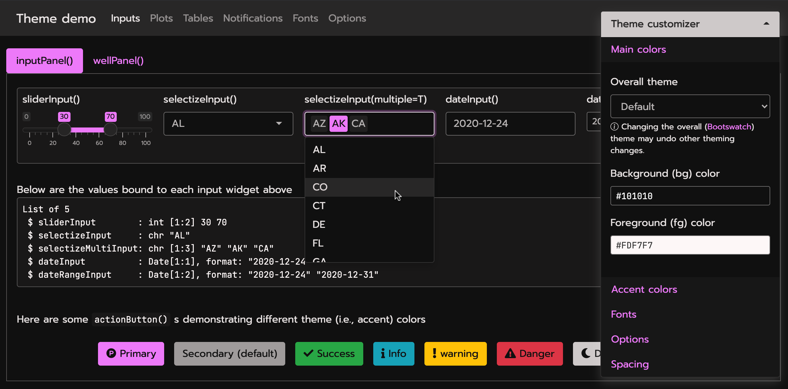

```{r, include=FALSE}
library(bslib)
knitr::opts_chunk$set(
  message = FALSE,
  collapse = TRUE,
  comment = "#>",
  out.width = "100%",
  fig.align = 'center',
  fig.width = 6,
  fig.asp = 0.618,  # 1 / phi
  fig.show = "hold"
)
include_vimeo <- function(id, width = "100%", height = "400") {
  url <- sprintf("https://player.vimeo.com/video/%s?title=0&byline=0&portrait=0", id)
  htmltools::tags$iframe(
    src = url,
    width = width,
    height = height,
    frameborder = "0",
    seamless = "seamless",
    webkitAllowFullScreen = NA,
    mozallowfullscreen = NA,
    allowFullScreen = NA
  )
}
```

```{scss, echo = FALSE}
@media (min-width: 800px) {
  .usage {
    display: flex;
    * {
      flex: 1;
    }
  }
}

div.info {
  padding: 2em;
  margin: 1em 0;
  padding-left: 100px;
  background-size: 70px;
  background-repeat: no-repeat;
  background-position: 15px center;
  min-height: 120px;
  color: #1f5386;
  background-color: #bed3ec;
  border: solid 5px #dfedff;
  background-image: url("infobox.svg");
  a {
    color: #e783b8;
  }
}
```


As we learned in [Basic usage](https://rstudio.github.io/bslib/#usage), any usage of `bslib` with Shiny and R Markdown is powered by `bs_theme()`. Here you can pick a major Bootstrap [version](#versions), choose a pre-packaged [Bootswatch](#bootswatch) theme, and/or [customize](#custom) various theming defaults. `bslib` even provides a interactive widget (`bs_themer()`) to change some of `bs_theme()`'s options [real-time](#real-time). 

In some more [advanced cases](#advanced), you might also want to know how to add additional Sass/CSS rules, leverage utility classes, and develop custom (themeable) components.

## Bootstrap versions {#versions}

At the time of writing, `bslib` currently supports:

* [Bootstrap 5](https://getbootstrap.com/docs/5.0/) `bs_theme(version = 5)`: intended for new projects. 
* [Bootstrap 4](https://getbootstrap.com/docs/4.6/) `bs_theme(version = 4)`: intended for legacy projects that happen to break with `version = 5`. 
* [Bootstrap 3](https://getbootstrap.com/docs/3.4/) `bs_theme(version = 3)`: intended for legacy projects that happen to break with `version = 4`.

`bslib` doesn't require that you actually specify a Bootstrap version. In that case, it provides the currently recommended version of Bootstrap for new projects. Currently Bootstrap 4 is recommended, but that will soon change to Bootstrap 5+ in future releases, so it's best practice to specify the version, especially if reproducibility is important and your project does any of the following:

* Uses [Bootstrap Sass variables](#low-level) directly.
* Uses [utility classes](#utility-classes).
* Adds custom HTML, CSS, or JavaScript that builds on Bootstrap.

## Bootswatch themes {#bootswatch}

Any [Bootswatch](https://bootswatch.com) theme is available through `bs_theme()`'s `bootswatch` argument. You may already be familiar with using these "pre-packaged" themes via the  `{shinythemes}` package (or via the `theme` parameter in R Markdown). Those legacy approaches only provide [Bootswatch 3 themes](https://bootswatch.com/3), but with `{bslib}`, you can use newer themes like [minty](https://bootswatch.com/minty).

<div class="usage">
```r
# Shiny usage
navbarPage(
  theme = bs_theme(bootswatch = "minty"),
  ...
)
```
```r
# R Markdown usage
---
output:
  html_document:
    theme:
      bootswatch: minty
---
```
</div>

```{r, echo = FALSE}
knitr::include_graphics("minty.png")
```

## Custom themes {#custom}

In addition to `version` and `bootswatch`, `bs_theme()` has some other named arguments for customizing [main colors and fonts](#main-colors). These named arguments (e.g., `bg`, `fg`, `base_font`, etc) are supported across [Bootstrap versions](#versions), making them useful for both new and legacy projects. If you're looking to customize lower-level aspects (e.g., headings, navbars, etc), then you'll want to know how to [work with Sass variables more directly](#low-level). Also, in the event that no Sass variable is available to meet your theming needs, you may need to write [additional CSS rules](#add-rules) and/or leverage [utility classes](#utility-classes).

### Main colors & fonts {#main-colors}

`bs_theme()` provides named arguments for customizing the main background color (`bg`), foreground color (`fg`), accent colors (`primary`, `secondary`, etc), and fonts (`base_font`, `heading_font`, `code_font`, etc). Here's an example of using a subset of these named arguments to implement a dark mode with custom fonts:

<div class="usage">
```r
# Shiny usage
navbarPage(
  theme = bs_theme(
    bg = "#101010", 
    fg = "#FDF7F7", 
    primary = "#ED79F9", 
    base_font = font_google("Prompt"),
    code_font = font_google("JetBrains Mono")
  ),
  ...
)
```

```r
# R Markdown usage
---
output:
  html_document:
    theme:
      bg: "#101010"
      fg: "#FDF7F7"
      primary: "#ED79F9"
      base_font:
        google: "Prompt"
      code_font:
        google: "JetBrains Mono"
---
```
</div>

```{r, echo = FALSE}

```

Among all the coloring options in `bs_theme()`, `bg`, `fg`, and `primary` are by far the most influential as they effect nearly every color on the page. In fact, `bg` and `fg` alone impact 100s of defaults --- everything from panels (e.g., `shiny::wellPanel()`, `shiny::inputPanel()`, etc) to navigation (e.g., `shiny::navbarPage()`, `shiny::tabsetPanel()`, etc) and more. The accent colors don't impact nearly as much, but `primary` does control the color for some important things like hyperlinks, `shiny::tabsetPanel()` links, accent/focus colors for inputs, and more. That being said, other accent colors can be handy for customizing things like `shiny::actionButton()` (defaults to the `secondary` color), `shiny::showNotification()` , or more generally any HTML content that leverages [Color Utility Classes](https://getbootstrap.com/docs/5.0/utilities/colors/).

::: {.info}
When choosing `bg` and `fg` colors, keep in mind that it's generally a good idea to pick colors with a similar hue but a large difference in their luminance.
:::

`bs_theme()` also provides 3 named arguments for main fonts: `base_font`, `heading_font`, and `code_font`. When using [web safe font combinations](https://www.w3schools.com/cssref/css_websafe_fonts.asp), it's ok to provide a character string of (comma-separated) font families to these arguments (e.g., `bs_theme(base_font = '"Times New Roman", Times, serif')`. Otherwise, use one of the `font_google()`, `font_link()`, and/or `font_face()` helpers to include the relevant file(s) so the client's browser may render the font(s). `font_link()` and `font_face()` are fairly low-level interfaces to [the CSS web font API](https://developer.mozilla.org/en-US/docs/Learn/CSS/Styling_text/Web_fonts), but `font_google()` has the additional ability to download and cache font file(s), making it so that an internet connection is needed only for the first time a particular font is used.

::: {.info}
When choosing fonts, keep in mind that it's generally good practice to put serif fonts in `base_font`, sans-serif fonts in `heading_font`, and monospace fonts in `code_font`. If you aren't sure where to start, [this article](https://fontpair.co/featured) has a nice gallery of Google Font pairings. 
:::

### Everything else {#low-level}

`bs_theme()` also provides access to 100s of more specific [theming options](bs5-variables.html) by considering anything passed through it's `...` argument to be a new [Bootstrap Sass variable defaults](https://getbootstrap.com/docs/5.0/customize/sass/#variable-defaults). This allows you to get more targetted with your theming; for example, let's set the [`$progress-bar-bg`](bs5-variables.html#progress-bar-bg) Sass variable to `'orange'` (a CSS color).

<div class="usage">
```r
# Shiny usage
bs_theme(
  bg = "#002B36", fg = "#EEE8D5", 
  "progress-bar-bg" = "orange"
)
```

```r
# R Markdown usage
---
output:
  html_document:
    theme:
      bg: "#002B36" 
      fg: "#EEE8D5"
      progress-bar-bg: "orange"
---
```
</div>

```{r, echo = FALSE, out.width="67%"}
knitr::include_graphics("progress-orange.png")
```

In addition to CSS values (e.g., `"orange"`), a variable can be any valid [Sass expression](https://sass-lang.com/documentation/variables), which is quite useful for leveraging Sass' built-in module's (e.g., [`mix()` for mixing colors](https://sass-lang.com/documentation/modules/color#mix)) 

```r
bs_theme("progress-bar-bg" = "mix(white, orange, 20%)")
#> $progress-bar-bg: mix(white, orange, 20%) !default;
#> @import "scss/_variables.scss";
```

Underneath the hood, `bs_theme()` works by placing [Sass variable defaults](https://sass-lang.com/documentation/variables#default-values) _before_ Bootstrap's variable defaults. That's why something like `bs_theme(primary = "red")` "just works" in the sense that it not only provides `$primary` with a new default value, but it also passes the value to other variables that default to `$primary` (e.g. [`$progress-bar-bg`](bs5-variables.html#progress-bar-bg)).

```r
# Reduced version of the Sass code behind `bs_theme(primary = "red")`
sass::sass("
  $primary: red !default; // First one wins
  $primary: blue !default;
  $progress-bar-bg: $primary !default;
  @debug $primary, $progress-bar-bg;
")
#> red, red
```

Since `bs_theme()` defines variables _before_ Bootstrap, we must define variables differently if they want to reference Bootstrap's Sass code. For example, what if we wanted `$progress-bar-bg` to default to `$secondary` instead of `$primary`?

```r
sass::sass(bs_theme("progress-bar-bg" = "$secondary"))
#> Error: Undefined variable: "$secondary".
```

Thankfully `bs_add_variables()` provides a workaround. By default, `bs_add_variables()` works just like `bs_theme()` (it puts variable definitions before other Sass code), but by with `.where = "declarations"`, we can place the definition after Bootstrap:

```r
bs_add_variables(bs_theme(), "progress-bar-bg" = "$secondary", .where = "declarations")
#> @import "scss/_variables.scss";
#> $progress-bar-bg: $secondary;
```

There's currently no easy way to define variables this way in R Markdown (other than using `!expr` to pass a `bs_theme()` object directly into `theme`)

```r
output:
  html_document:
    theme: !expr bslib::bs_add_variables(bslib::bs_theme(), "progress-bar-bg" = "$secondary", .where = "declarations")
```

## Real-time theming {#real-time}

Use `bs_theme_preview()` (or `bs_themer()`) to create custom themes in "real-time" via an interactive theming widget. The former overlays the widget on a demo Shiny app ([see here](https://testing-apps.shinyapps.io/themer-demo) for a hosted version):

```r
bs_theme_preview()
```

```{r, echo = FALSE}
knitr::include_graphics("https://i.imgur.com/KLKy1s0.gif")
```

The latter (`bs_themer()`) may be used with any Shiny app or R Markdown document. Just make sure you're providing [Bootstrap 4 (or higher)](#versions) to the page constructor and call `bs_themer()` in a Shiny runtime content (i.e., within the `server` function).

<div class="usage">
```r
# Shiny usage
ui <- navbarPage(
  theme = bs_theme(),
  ...
)
server <- function(input, output) {
  bs_themer()
  ...
}
```

````
# R Markdown usage
---
runtime: shiny
output:
  html_document:
    theme:
      bslib: true
---

`r ''````{r}
bslib::bs_themer()
```

````
</div>

By the way, when running the real-time themer locally in a Shiny app, you'll see output like this in your R console (in R Markdown, you'll see YAML output instead of R code) to reproduce the theming changes:

```{r, echo = FALSE, out.width="80%"}
knitr::include_graphics("themer-code.png")
```

## Dynamic theming {#dynamic}

The functionality behind [real-time](#real-time) theming can be leveraged in any Shiny app (or `runtime:shiny` Rmd doc) to implement your own custom theming widget (via `session$setCurrentTheme()`), like a dark mode switch:

```r
light <- bs_theme()
dark <- bs_theme(bg = "black", fg = "white", primary = "purple")
ui <- fluidPage(
  theme = light, 
  checkboxInput("dark_mode", "Dark mode")
)
server <- function(input, output, session) {
  observe(session$setCurrentTheme(
    if (isTRUE(input$dark_mode)) dark else light
  ))
}
shinyApp(ui, server)
```

```{r, echo = FALSE, out.width="50%"}
knitr::include_graphics("dark-mode.gif")
```

See the sections on `setCurrentTheme` and `getCurrentTheme` [here](https://shiny.rstudio.com/reference/shiny/1.6.0/session.html) to learn more.

## Advanced theming {#advanced}

### Adding rules {#add-rules}

A good amount of theming is possible by customizing Bootstrap Sass variables in `bs_theme()`, but sometimes you may also want to add additional Sass/CSS rules. The `bs_add_rules()` function makes this easy for Shiny usage. Here's an example of adding [nes.css](https://github.com/nostalgic-css/NES.css/), which adds additional styles for things like the mouse cursor (on top of `bs_theme()`s theming options).

```r
bs_theme(
  bg = "#e5e5e5", fg = "#0d0c0c", primary = "#dd2020",
  base_font = font_google("Press Start 2P"),
  code_font = font_google("Press Start 2P"),
  "font-size-base" = "0.75rem", "enable-rounded" = FALSE
) %>%
  bs_add_rules(
    '@import "https://unpkg.com/nes.css@latest/css/nes.min.css"'
  )
```

```{r, echo = FALSE}
knitr::include_graphics("nes.png")
```

In the R Markdown case, it's recommended that additional CSS (or Sass) rules come through the `css` parameter, but you may also use the `bslib` engine. As with `bs_add_rules()`, these rules can reference Bootstrap Sass variables as well as utilize convenient Sass mixins or functions like [`color-contrast()`](https://github.com/rstudio/bslib/blob/c95d6b/inst/sass-utils/color-contrast.scss#L9), [`mix()`](https://sass-lang.com/documentation/modules/color#mix), etc.

````
---
output:
  html_document:
    theme: 
      version: 4
    css: my-rules.scss
---

`r ''````{bslib}
$custom-bg: rgba($primary, 0.3);
.custom {
  background-color: $custom-bg;
  color: color-contrast(opaque($body-bg, $custom-bg))
}
```

::: {.custom}
Hello custom block with custom styles!
:::

````

### Utility Classes {#utility-classes}

With [Bootstrap 4 (or higher)](#versions), you can use utility classes to easily add or subtract styles on specific elements to handle common UI problems like spacing, border, colors, and more. See the article on [Utility Classes](utility-classes.html) for some useful examples specific to Shiny and R Markdown.

## Component support

Below is a list of known-to-be themeable HTML components that "just work" well with custom real-time themes:

* All of "core" Shiny UI (e.g., `sliderInput()`, `selectInput()`, `tabPanel()`, `navbarPage()`, etc.) 
  * The one exception is `plotOutput()`, but in that case, [the `{thematic}` package can be used to essentially translate CSS to R plot theming defaults](https://rstudio.github.io/thematic/articles/auto.html). Just put `thematic_shiny()` in your Shiny apps and `thematic_rmd()` in your R Markdown documents.
  
* All of `rmarkdown::html_document()` specific [features](https://bookdown.org/yihui/rmarkdown/html-document.html) as well as [`{flexdashboard}`](https://flexdashboard-pkg.netlify.app/articles/theme.html).

* Any un-styled HTML content (e.g., `tags$input(type = "checkbox")`).

* Some `{htmlwidgets}` like `{DT}` and `{plotly}` (only `ggplotly()` is supported through `{thematic}` right now)

Over time, we're hoping this list grows as package authors and developers embrace `bslib`'s tools for making [themeable custom components](custom-components.html).
