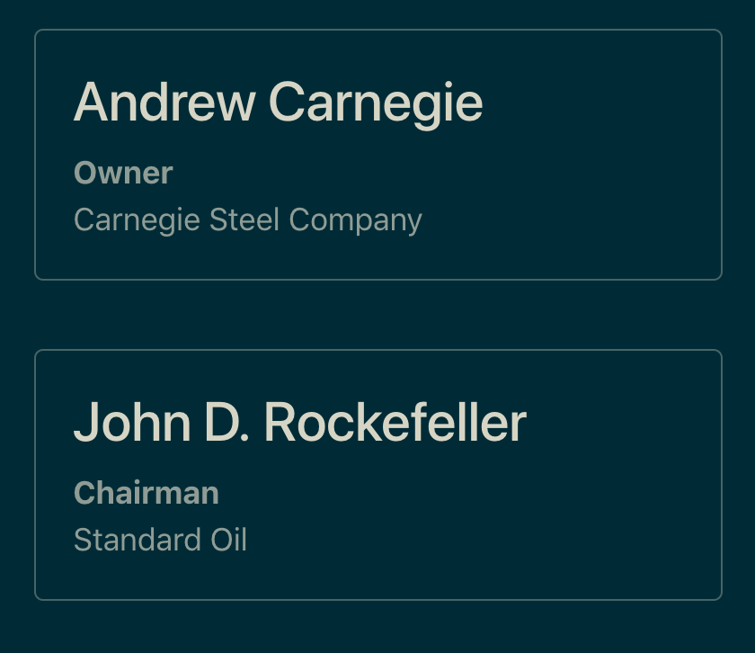

```{r, include = FALSE}
knitr::opts_chunk$set(
  message = FALSE,
  comment = "#>",
  collapse = TRUE
)
```

<style>
pre {
  border: 1px solid #eee;
}

pre.r {
  background-color: #ffffff;
}

pre.r code {
  background-color: #ffffff;
}

pre.css {
  margin-top: -1rem;
  background-color: #f8f8f8;
  border-radius: 0;
  border-bottom-left-radius: 4px;
  border-bottom-right-radius: 4px;
}
</style>

**bootstraplib** provides several functions for creating (i.e., `bs_global_theme()`) and adding to (i.e., `bs_theme_add_variables()` and `bs_theme_add()`) a global theme object. By default, `bs_dependencies()` includes this global theme when compiling Bootstrap Sass into CSS. Eventually, both **shiny** and **rmarkdown** will implicitly call `bs_dependencies()` to grab their Bootstrap dependency (as of today, you need to [do this explictly](https://github.com/rstudio/bootstraplib#readme)), which means that you'll eventually be able to use the same code to theme **shiny**, **rmarkdown**, as well as relevant by-products (e.g., **flexdashboard**).

This article summarizes the fundamental concepts behind theming with **bootstraplib**. These foundations build on top of lower-level foundations provided by the **sass** package, so it's highly recommended that those new to the **sass** and the [Sass language](https://sass-lang.com/) also read the [**sass** overview](https://rstudio.github.io/sass/articles/sass.html). The aim of this article is provide you with the mental model you'll need to perform advanced theming with **bootstraplib**. If you're looking for more of a "recipe book" of **shiny**/**rmarkdown** theming examples with Bootstrap 4, see [the Recipes article](recipes.html).

## Themes are layers

**bootstraplib** themes are built upon [sass::sass_layer()](https://rstudio.github.io/sass/articles/sass.html#layers), which provides a convenient structure for organizing and combining multiple 'layers' or 'bundles' of styles in a composable way. Layers, and therefore themes, have three main components: `defaults` (for overriding variable defaults), `declarations` (for declaring Sass functions/mixins), and styling `rules`. Indeed, when you initialize a theme with `bs_global_theme()`, the class and names of the theme reflect these core pieces of the **sass** layer:

```{r}
library(bootstraplib)
bs_global_theme()
class(bs_global_get())
names(bs_global_get())[1:3]
```

This following sections detail how to add your own layers of **sass** code to the theme via `bs_theme_add()` (and, a special case of it, `bs_theme_add_variables()`) with a special focus on common and useful patterns for theming with Bootstrap Sass. By far and away the most important component of the theme (i.e. layer) is `defaults`: this is where you have the opportunity to override [Bootstrap variable defaults](https://getbootstrap.com/docs/4.4/getting-started/theming/#variable-defaults), which is the main (and easiest) approach to theming with Bootstrap Sass.

## Defaults {#defaults}

Whenever you `bs_theme_add()` to a theme, it hoists any `defaults` to the top of the existing theme defaults. You can pass any input understood by `sass::as_sass()` here, including a named list, which is interpreted as variable definitions.

```r
bs_theme_add(defaults = list(primary = "red !default"))
bs_global_get()$defaults
```

```css
/* Sass */
$primary: red !default;
@import "/path/to/bootstrap/scss/_functions.scss";
@import "/path/to/bootstrap/scss/_variables.scss";
```

When overriding variable defaults, it's best practice to include a [`!default` flag](https://sass-lang.com/documentation/variables#default-values), which says "assign this value to this variable _if it isn't already defined_". This way, downstream theming decisions are allowed take precedence over upstream ones. Since this is such a common and suggested practice, we've provided `bs_theme_add_variables()`, which makes sure you've included a `!default` flag and interprets its arguments as variable names: 

```r
bs_theme_add_variables(primary = "green")
bs_global_get()$defaults
```

```css
/* Sass */
$primary: green !default;
$primary: red !default;
@import "/path/to/bootstrap/scss/_functions.scss";
@import "/path/to/bootstrap/scss/_variables.scss";
```

To demonstrate that the `green` default actually overrides the `red` default, we'll use `bs_sass()`, which uses the current theming `defaults` (and `declarations`) to compile Sass styling `rules` as a CSS string. We're using `bs_sass()` here purely for the sake of demonstration, but take note that this function can come in handy for styling custom CSS classes with Bootstrap Sass (this styling rule says to set the `foo` class' `color` property to `$primary`). 

```{r, class.output='css', comment=''}
bs_sass(".foo { color: $primary; }")
```

The right-hand side of a variable definition may be any valid Sass expression, so to do something like [add a new theme color](https://getbootstrap.com/docs/4.4/getting-started/theming/#add-to-map), which requires assigning a [Sass map](https://sass-lang.com/documentation/values/maps) to [the $theme-colors variable](https://github.com/rstudio/bootstraplib/blob/8c883fad/inst/node_modules/bootstrap/scss/_variables.scss#L78-L92), you can do:

```{r}
bs_theme_add_variables(
  "theme-colors" = "('foo-color': orange)"
)
```

Also note that Bootstrap provides convenient [functions for accessing values of map variables](https://getbootstrap.com/docs/4.4/getting-started/theming/#functions) like `$theme-colors`, `$colors`, and `$grays` (i.e., the main entry points for setting color defaults).

```{r, class.output='css', comment=''}
bs_sass(".foo { color: theme-color('foo-color') }")
```

## Declarations {#declarations}

Theme `declarations` appear immediately after `defaults`, and are intended for mainly 2 things: [Sass mixins](https://sass-lang.com/documentation/at-rules/mixin) and variable overrides that want to reference other variables or functions. Note that writing your own mixins is really own useful if you intend on writing a lot of your own custom styling `rules`, so we don't discuss them, but here's a contrived example of how you might want to add mixins to the current theme with `bs_theme_add()`. In this example, since new theme `declaration` are placed after existing ones, mixins that appear in the `mixin2.scss` file could use mixins from the `mixin1.scss` file.

```r
bs_theme_add(declarations = sass::sass_file('mixin1.scss'))
bs_theme_add(declarations = sass::sass_file('mixin2.scss'))
```

In some situations, you may want to use Bootstrap functions (e.g. [`color-yiq()`](https://getbootstrap.com/docs/4.4/getting-started/theming/#color-contrast)) and/or other Bootstrap variables in your variable definitions. For this scenario, you may set `.where = "declarations"` in `bs_theme_add_variables()`, which places the variable definitions *after* (instead of before) Bootstrap declarations (i.e., variables, functions, and mixins). For example, we could have the body's background inherit the secondary theme color and have the body's foreground color automatically contrast based on the background color.^[Note that if, for some reason, you wanted a theme color to be based on another variable, you'd have to do, `bs_theme_add_variables("theme-colors" = 'map-merge($theme-colors, ("primary": $dark))', .where = "declarations")`, since the `$theme-colors` map is [constructed before declarations](https://github.com/rstudio/bootstraplib/blob/8c883fad/inst/node_modules/bootstrap/scss/_variables.scss#L78-L92).]


```r
bs_global_theme()
bs_theme_add_variables(
  "body-bg" = "$secondary",
  "body-color" = "color-yiq($secondary)",
  "well-color" = "$body-color",
  "table-color" = "$body-color",
  .where = "declarations"
)
bs_theme_preview()
```

```{r, echo = FALSE}
knitr::include_graphics("https://i.imgur.com/Jzgv4zd.png")
```


## Rules

Generating custom [styling rules](https://sass-lang.com/documentation/style-rules) based on Bootstrap is useful in at least a couple scenarios:

1. For some reason, you need to override Bootstrap's styling rules to achieve the styling you desire.
2. You want to generate _new_ rules, say new classes, that utilize Bootstrap's functions, mixins, and/or variables.

For an example of (2), see this [person.scss](https://github.com/rstudio/bootstraplib/blob/master/inst/custom/person.scss) file, which defines rules for a custom `person` class, for displaying someone's name, title, and company. To include these rules with the bundle that `bs_dependencies()` generates, provide them to the `rules` argument of the `bs_theme_add()` function.^[You can also compile these rules with `bs_sass()` which returns a CSS string. In that case, you'd have to manually [include the string as a `<style>` tag](http://rstudio.github.io/sass/articles/sass.html#shiny-string).]

```r
library(shiny)
bs_global_theme()
bs_theme_add(
  rules = sass::sass_file(
    system.file("custom", "person.scss", package = "bootstraplib")
  )
)
# Include custom CSS that leverages bootstrap Sass variables
person <- function(name, title, company) {
  tags$div(
    class = "person",
    h3(class = "name", name),
    div(class = "title", title),
    div(class = "company", company)
  )
}
ui <- fluidPage(
  bs_dependencies(),
  person("Andrew Carnegie", "Owner", "Carnegie Steel Company"),
  person("John D. Rockefeller", "Chairman", "Standard Oil")
)
shinyApp(ui, function(input, output) {})
```

```{r, echo = FALSE}

```


## Summary {#summary}

Themes have three main components: `defaults` (for overriding variable defaults), `declarations` (for declaring Sass functions and mixins), and styling `rules`. `bs_theme_add()` may be used to add any of these components to the existing theme and `bs_theme_add_variables()` is specifically designed for setting variable `defaults`. Recall that when you add to an existing theme:

* `defaults` for downstream `bs_theme_add()`s are placed _before_ `defaults` for upstream `bs_theme_add()`s.
  * Allowing downstream Sass to override variable defaults in upstream Sass.
* `declarations` for downstream `bs_theme_add()`s are placed _after_ `declarations` for upstream `bs_theme_add()`s.
  * Allowing downstream Sass to use functions and mixins defined in upstream Sass.
  * Allowing variable definitions to use variables defined in `defaults` (or prior declarations).
* `rules` for downstream `bs_theme_add()`s are placed _after_ `rules` for upstream `bs_theme_add()`s.
  * Allows downstream rules to take precedence over upstream rules ([precedence](https://css-tricks.com/precedence-css-order-css-matters/) matters when there are multiple rules with the same level of [specificity](https://css-tricks.com/specifics-on-css-specificity/)).


It's also worth noting that `sass::sass_layers()`, and thus themes, have more than these three components. It's also possible to [resolve relative file imports](https://rstudio.github.io/sass/articles/sass.html#imports-relative) and  [include HTML dependencies](https://rstudio.github.io/sass/articles/sass.html#html-dependencies).
