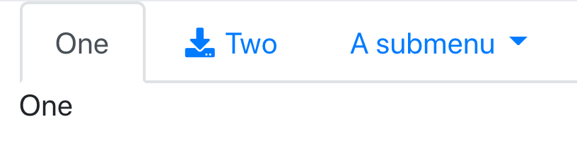

```{r, include=FALSE}
library(bootstraplib)
knitr::opts_chunk$set(
  out.width = "60%",
  fig.align = "center"
)
```

> **DISCLAIMER:** This document demonstrates what's possible _today_ with **bootstraplib** theming and is still a work in progress. It should become more complete and keep improving in the coming months.

The following sections contain "recipes" for custom theming of **shiny** apps and **rmarkdown** documents via **bootstraplib**. Most the example code here is specifically for **shiny**, so you'll see repeated use of `bs_theme_new()` to start a new theme; but note that calling `bs_theme_new()` inside **rmarkdown** documents is not necessary (the `bootstrap_version` and `theme` arguments to `rmarkdown::html_document` should instead be used to choose the version and bootswatch theme). 

For the sake of novelty, some of the more specific recipes focus on theming **shiny** apps with [Bootstrap 4 Sass](https://getbootstrap.com/docs/4.4/getting-started/theming/), but many of the same ideas can also translate to [Bootstrap 3 Sass](https://github.com/twbs/bootstrap-sass). For those looking to learn more about the foundational **bootstraplib** and **sass** tools that make these recipes possible, see the [foundations article](foundations.html).

## Colors

The quickest and simplest way to provide a custom color palette to a **bootstraplib** theme is to use `bs_theme_base_colors()` and `bs_theme_accent_colors()`. These functions are designed to work with any version of Bootstrap and control numerous color styling defaults in **shiny** apps and **rmarkdown** documents that use `bootstraplib::bootstrap()`. More specifically, these functions set numerous [Bootstrap Sass variable defaults](https://getbootstrap.com/docs/4.4/getting-started/theming/#variable-defaults) via `bs_theme_add_variables()` (you can always use this function to set specific Sass variable defaults, if you wish).

```r
library(bootstraplib)
bs_theme_new()
# Color palette derives from https://tombrow.com/dark-mode-website-css
bs_theme_base_colors(bg = "#444", fg = "#e4e4e4")
bs_theme_accent_colors(primary = "#e39777", secondary = "#fdce93")
bs_theme_preview()
```

```{r, echo = FALSE}
knitr::include_graphics("https://i.imgur.com/750Qc2a.png")
```

## Fonts

Use the `bs_theme_fonts()` function to easily set the default (i.e., `base`) font family, as well as families for `code`, `heading`s, and `input`:

```r
bs_theme_fonts(base = "Roboto Slab", code = "Monaco")
bs_theme_preview()
```

```{r, echo = FALSE}
knitr::include_graphics("https://i.imgur.com/G3rsl9u.png")
```

TODO: `$font-size-base`

For fonts that don't already exist on the applications host, you may want to consider downloading the relevant font files and serving those font files with your application. The [**gfonts**](https://github.com/dreamRs/gfonts) package offers a nice way to `download_font()`s from Google Fonts. For example, if our working directory was a **shiny** app directory, and we want the Monserrat font, we could run:

```r
library(gfonts)
font_dir <- "www/fonts"
if (!dir.exists(font_dir)) dir.create(font_dir)
download_font("montserrat", output_dir = font_dir)
```

Then, use `bs_theme_fonts()` to let Bootstrap know to use the Monserrat font as well as `bs_theme_add()`+`generate_css()` to let the browser know where the find the font files:

```r
bs_theme_fonts(base = "Monserrat")
bs_theme_add(rules = generate_css("montserrat", font_dir = font_dir))
shiny::runApp()
```

## Plots

In [a future version of **shiny**](https://github.com/rstudio/shiny/pull/2740), `renderPlot()` (and `renderCachedPlot()`) will be able to use the foreground and background color of its HTML container to automatically apply intelligent theming defaults to **ggplot2**, **lattice**, and **base** graphics. That means, by just setting `shinyOptions(plot.autotheme = TRUE)` and (optionally) using `bs_theme_base_colors()`, your plots with change their default styling to look consistent with the rest of the application. Notice how, in addition to the foreground and background color, auto-theming will also use the link color (i.e. `primary`) as an `accent` color (see `?shiny::autoThemeOptions` for more info).

```r
# remotes::install_github("rstudio/shiny#2740")
shinyOptions(plot.autotheme = TRUE)
bs_theme_preview()
```

```{r, echo = FALSE}
knitr::include_graphics("https://i.imgur.com/DoesYAR.png")
```

## Tables

[A future version](https://github.com/rstudio/DT/pull/740) of **DT** will gain the ability to automatically theme itself based on currently set **bootstraplib** theme, which works with `DT::dataTableOutput()` inside **shiny** as well as with `DT::datatable()` in **rmarkdown**.

```r
# remotes::install_github("rstudio/DT#740")
bs_theme_preview()
```

```{r, echo = FALSE}
knitr::include_graphics("https://i.imgur.com/Zlwa2hw.png")
```

For more granular control, you can set the [Bootstrap table](https://getbootstrap.com/docs/4.4/content/tables/) [Sass variables](https://github.com/rstudio/bootstraplib/blob/ba67fa9/inst/node_modules/bootstrap/scss/_variables.scss#L355-L369) more directly via `bs_theme_add_variables()` and **DT** should style itself sensibly based on these values. Alternatively, you can also override [dataTables Sass variable](https://github.com/DataTables/DataTablesSrc/blob/ce2c7c1/css/jquery.dataTables.scss#L9-L28) defaults directly using `DT::datatableThemeVariables()`. The upside of the former (i.e., `bs_theme_add_variables()`) approach is that you can theme both `DT::dataTableOutput()` as well as the more basic `shiny::dataTableOutput()` all at once. The upside of the latter approach (i.e., `DT::datatableThemeVariables()`) is that you can theme **DT** outside of **shiny** and **rmarkdown** and without depending on Bootstrap. 

## Other shiny outputs

Core **shiny** outputs like `renderPlot()`, `renderTable()`, `renderPrint()`, etc. have support for auto-theming based on the current **bootstraplib** theme. However, at least initially, other third-party outputs won't auto-theme themselves, but developers will have the opportunity to implement such behavior by adding a `shiny-report-theme` class to their output's HTML container (**htmlwidgets** can do this by setting `reportTheme = TRUE` in `shinyWidgetOutput()`) and using `shiny::getCurrentOutputInfo()` server-side to obtain relevant computed styles (as shown below).

```r
shinyApp(
  fluidPage(bootstrap(),
    tagAppendAttributes(
      verbatimTextOutput("info"), 
      class = "shiny-report-theme"
    )  
  ),
  function(input, output) {
    output$info <- renderPrint(getCurrentOutputInfo())
  }
)
```

```{r, echo = FALSE}
knitr::include_graphics("https://i.imgur.com/wkJ7joO.png")
```

## Wells

Core **shiny** UI functions like `wellPanel()` and `sidebarPanel()` are based on the [BS3 well class](https://getbootstrap.com/docs/3.4/components/#wells). When `version = "4+3"`, this class extends the BS4 `card` class, making it feasible to style wells using some of the [card theming variables](https://github.com/rstudio/bootstraplib/blob/ba67fa9f6/inst/node_modules/bootstrap/scss/_variables.scss#L829-L850). We also introduce our own [`$well-bg` variable](https://github.com/rstudio/bootstraplib/blob/ba67fa9f6/inst/bs3compat/_declarations.scss#L27) to set the background color to get the right default styling. Here we'll set that Sass variable to a [mix](https://sass-lang.com/documentation/modules/color#mix) of 80% of the base background color and 20% of the foreground color:

```r
bs_theme_add_variables(
  "well-bg" = "mix(#444444, #e4e4e4, 80%)",
  "card-border-color" = "darken($well-bg, 5%)",
  "card-border-radius" = 0,
  "card-border-width" = "0.5rem"
)
bs_theme_preview()
```

```{r, echo = FALSE}
knitr::include_graphics("https://i.imgur.com/9ogwq0C.png")
```


## Navigation {#theming-nav}

Both **shiny** and **rmarkdown** allow you create so called "tabset panels", which are built on top of Bootstrap's [nav](https://getbootstrap.com/docs/4.4/components/navs/) API. These tabsets come in two different flavors: tabs and pills. Below is a table showing how to create either flavor of navigation in both **shiny** and **rmarkdown**. We'll walk through theming with tabs (i.e., `tabsetPanel()`) and pills (i.e., `navlistPanel()`) in **shiny**, but it's worth noting that the same ideas apply to [**rmarkdown**'s tabbed sections](https://bookdown.org/yihui/rmarkdown/html-document.html#tabbed-sections) as well.


|       | shiny            | rmarkdown                 |
|-------|------------------|---------------------------|
| tabs  | `tabsetPanel()`  | `{.tabset}`               |
| pills | `navlistPanel()` | `{.tabset .tabset-pills}` |


### Pills

Let's start with a basic `navlistPanel()`, which is based on Bootstrap nav pills:

```r
library(shiny)
library(bootstraplib)

ui_content <- navlistPanel(
  tabPanel("One", "One"),
  tabPanel("Two", icon = icon("download"), "Two"),
  navbarMenu("A submenu",
             tabPanel("Three", "Three"),
             "---",
             tabPanel("Four", "Four"),
             tabPanel("Five", "Five")
  )
)

# Clear the current theme
bs_theme_new()

# Resuable function to preview our theming changes
preview_pills <- function() {
  shinyApp(
    fluidPage(bootstrap(), ui_content), 
    function(input, output) {}
  )
}
preview_pills()
```

```{r, echo = FALSE}
knitr::include_graphics("pills.png")
```

Bootstrap 4 currently exposes 3 different Sass variables specifically for pill styling, including the [foreground](https://github.com/rstudio/bootstraplib/blob/04925e1/inst/node_modules/bootstrap/scss/_variables.scss#L713) and [background](https://github.com/rstudio/bootstraplib/blob/04925e1/inst/node_modules/bootstrap/scss/_variables.scss#L714) color of active pills:

```scss
$nav-pills-link-active-color: $component-active-color !default;
$nav-pills-link-active-bg:    $component-active-bg !default;
```

Importantly, these active colors default to variables that control the active color of _all_ Bootstrap components, and by default, the primary theme color controls the active color:

```scss
$component-active-color:      $white !default;
$component-active-bg:         theme-color("primary") !default;
```

Therefore, we could just change the primary theme color to get a different active color scheme.

```r
bs_theme_new()
bs_theme_add_variables(
  "primary" = "orange",
  "nav-pills-border-radius" = 0,
)
preview_pills()
```

```{r, echo = FALSE}
knitr::include_graphics("orange-pills.png")
```

If you wanted the bg color of the active pills directly, you could set `$nav-pills-link-active-bg`; but in that case, you should also set  `$dropdown-link-active-bg` (which controls `navbarMenu()`'s active bg color) as well as `$link-color` (which controls the non-active pill text color).

```r
bs_theme_new()
bs_theme_add_variables(
  "nav-pills-link-active-bg" = "orange",
  "dropdown-link-active-bg" = "orange",
  "link-color" = "orange"
)
```

### Tabs

Let's start with a basic `tabsetPanel()`, which is based on Bootstrap nav pills:

```r
library(shiny)
library(bootstraplib)

ui_content <- tabsetPanel(
  tabPanel("One", "One"),
  tabPanel("Two", icon = icon("download"), "Two"),
  navbarMenu("A submenu",
             tabPanel("Three", "Three"),
             "---",
             tabPanel("Four", "Four"),
             tabPanel("Five", "Five")
  )
)

bs_theme_new()

# Resuable function to preview our theming changes
preview_tabs <- function() {
  shinyApp(
    fluidPage(bootstrap(), ui_content), 
    function(input, output) {}
  )
}
preview_tabs()
```


```{r, echo = FALSE}

```

For the most part the [variable defaults for tabs](https://github.com/rstudio/bootstraplib/blob/ba67fa9f/inst/node_modules/bootstrap/scss/_variables.scss#L704-L710) work well with lighter themes, but for darker themes, you'll likely want to set `$nav-tabs-link-active-color` to something similar to `$body-color`. Also, it's not obvious from the variables file, but the non-active tab text color derives from `$link-color`, which defaults to `$primary`. So if you want to change the non-active tab color without changing `$primary`, set `$link-color` (and also `$dropdown-link-active-bg`) if your tabs have [dropdowns](https://github.com/rstudio/bootstraplib/blob/ba67fa9f/inst/node_modules/bootstrap/scss/_variables.scss#L762-L788).

```r
bs_theme_add_variables(
  "body-bg" = "#6c757d",
  "body-color" = "white",
  "nav-tabs-link-active-color" = "white",
  # Non-active tab/link styling
  "link-color" = "lime",
  # For dropdown
  "dropdown-link-active-bg" = "lime",
)
preview_tabs()
```

```{r, echo = FALSE}
# TODO: why doesn't `$dropdown-link-hover-bg` work? bs3compat issue?
knitr::include_graphics("tabs-lime.png")
```


## Buttons

Core **shiny** UI functions like `downloadButton()` and `actionButton()` emit HTML markup with the [BS3 `btn-default` class](https://getbootstrap.com/docs/3.4/components/#dropdowns-example), which was dropped in BS4. When `version = "4+3"`, the `btn-default` class extends the BS4 `btn-secondary` class, which is why the default button picked up on `bs_theme_accent_colors(secondary = "#fdce93")` (i.e., the yellow-ish color):

```{r, echo = FALSE}
knitr::include_graphics("https://i.imgur.com/pQNam7S.png")
```

The other buttons contain different background colors because they contain [`btn-*` modifier classes](https://getbootstrap.com/docs/4.4/components/buttons) via a `class` argument to `actionButton()` (e.g., `actionButton(..., class = "btn-primary")`). It's worth noting that `actionButton()`, like many other core shiny UI components, doesn't actually have an explicit `class` argument, but it does route implicit argument (i.e., `...`) to it's top-level HTML container, which is why `actionButton(..., class = "btn-primary")` add the class in the appropriate place. More generally, in other cases where `...` doesn't route to the HTML tag target of interest (i.e., for [utility classes](https://getbootstrap.com/docs/4.4/utilities/borders/)), the next best option is to add a class via `tagAppendAttributes(ui, class = 'some-class')`.
