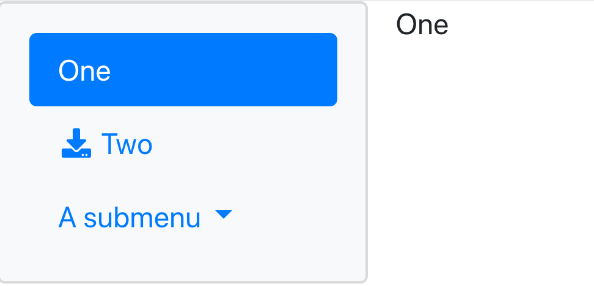

```{r, include=FALSE}
knitr::opts_chunk$set(
  out.width = "60%",
  fig.align = "center"
)
```

## Bootstrap 4

> **NOTE**: For best styling results, you currently need to install the development version of Shiny --- `remotes::install_github("rstudio/shiny")`.

If you'd like to start using Bootstrap 4 in your Shiny apps today, you can place the return value of `bootstrap()` somewhere in your user interface, for example:

```r
library(shiny)
library(bootstraplib)

ui_content <- navlistPanel(
  tabPanel("One", "One"),
  tabPanel("Two", icon = icon("download"), "Two"),
  navbarMenu("A submenu",
             tabPanel("Three", "Three"),
             "---",
             tabPanel("Four", "Four"),
             tabPanel("Five", "Five")
  )
)

ui <- fluidPage(bootstrap(), ui_content)
shinyApp(ui, function(input, output) {})
```

<!--
withr::with_dir("vignettes", save_html(ui, "default.html", libdir = "default"))
-->

```{r, echo = FALSE, fig.link="default.html"}

```

Equivalently, you can replace your Shiny page layout (e.g., `fluidPage()`)  with a suitable replacement from the page layouts available in the **bs4** package (e.g. `bs4_page_fluid()`). In the future, the **bs4** R package will provide additional Bootstrap 4 specific helpers for things like  [components](https://getbootstrap.com/docs/4.4/components/alerts/), [layout](https://getbootstrap.com/docs/4.4/layout/overview/), [utility classes](https://getbootstrap.com/docs/4.4/utilities/borders/), and more.

<!-- TODO: provide a mapping from shiny page layouts to bs4 layouts? -->

```r
ui <- bs4::bs4_page_fluid(ui_content)
shinyApp(ui, function(input, output) {})
```

Whether you call `bootstrap()` explicitly, or implictly via **bs4**, you'll be able to use Bootswatch and/or [custom themes](custom.html).

## Theming

To quickly get a set of different styling defaults, provide a [Bootswatch theme](https://bootswatch.com/) name:

```r
ui <- fluidPage(bootstrap('sketchy'), ui_content)
shinyApp(ui, function(input, output) {})
```

<!--
withr::with_dir("vignettes", save_html(ui, "sketchy.html", libdir = "sketchy"))
-->

```{r, echo = FALSE, fig.link="sketchy.html"}
knitr::include_graphics("sketchy.png")
```

Or equivalently with **bs4**:

```r
bs4::bs4_page_fluid(theme = 'sketchy', ui_content)
```

**Note**: If you want to use Bootswatch _and_ a [custom theme](custom.html), then don't specify the Bootswatch theme this way --- use `bs_theme_new()` instead. Learn more about custom themes in [this article](custom.html) (see also the section on [theming core **shiny** UI](custom.html#shiny)).

```r
# Start with a sketchy theme then override the primary color
bs_theme_new(bootswatch = 'sketchy')
bs_theme_add_variables(primary = 'salmon')
ui <- fluidPage(bootstrap(), ui_content)
shinyApp(ui, function(input, output) {})
```

<!--
withr::with_dir("vignettes", save_html(ui, "sketchy-salmon.html", libdir = "sketchy-salmon"))
-->

```{r, echo = FALSE, fig.link="sketchy-salmon.html"}
knitr::include_graphics("sketchy-salmon.png")
```


