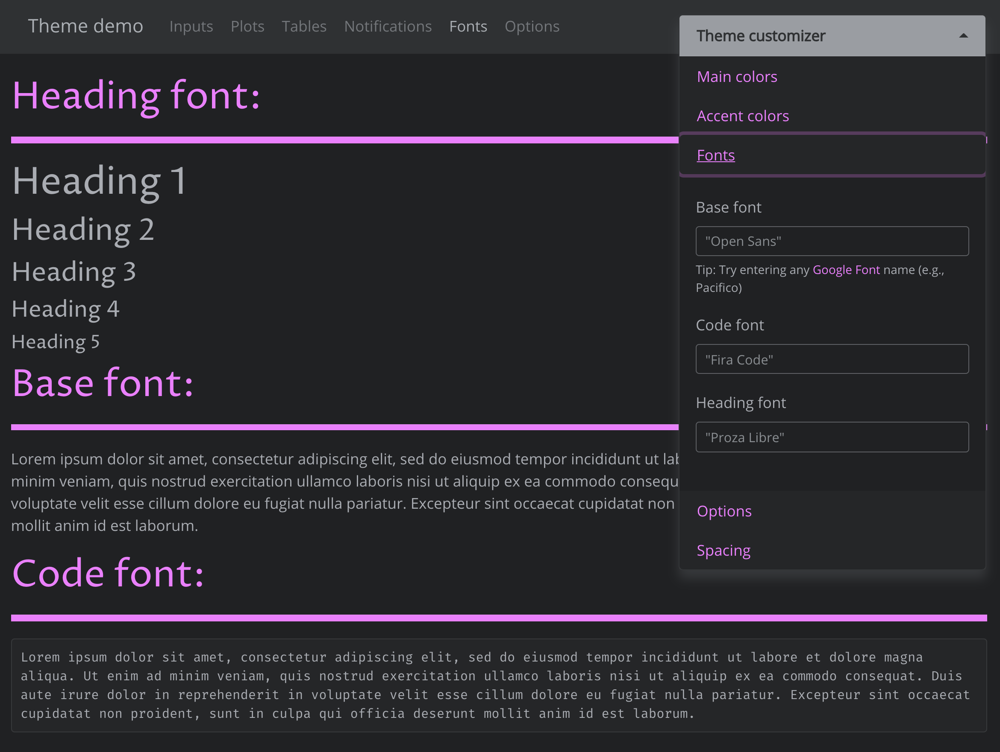
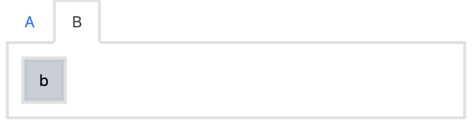
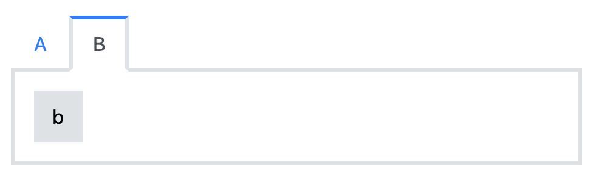
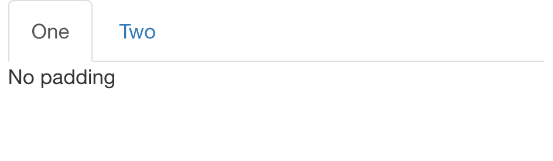
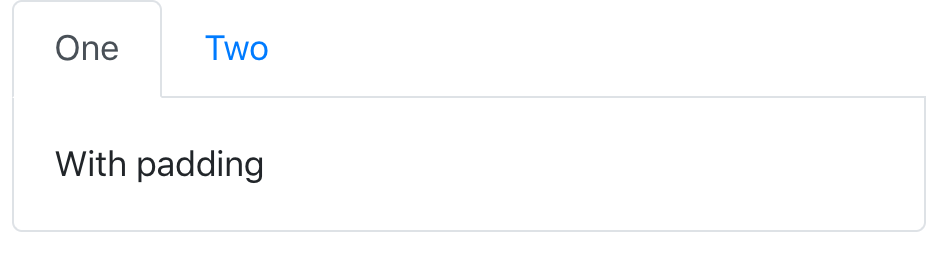
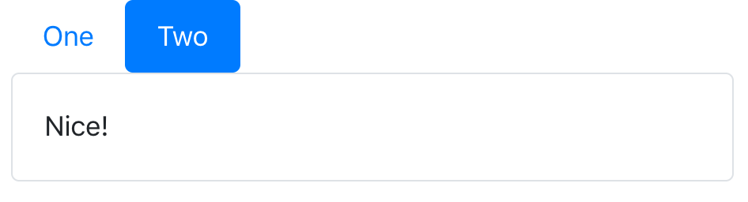
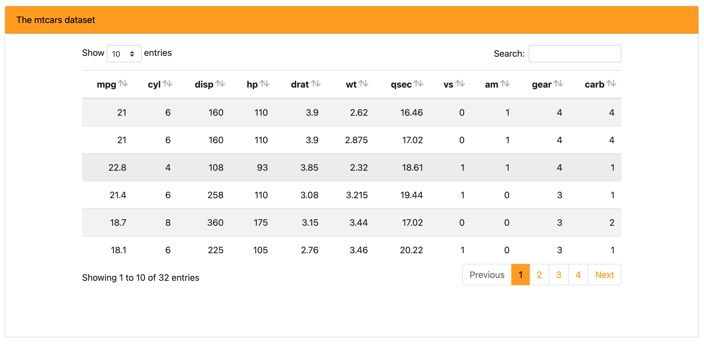
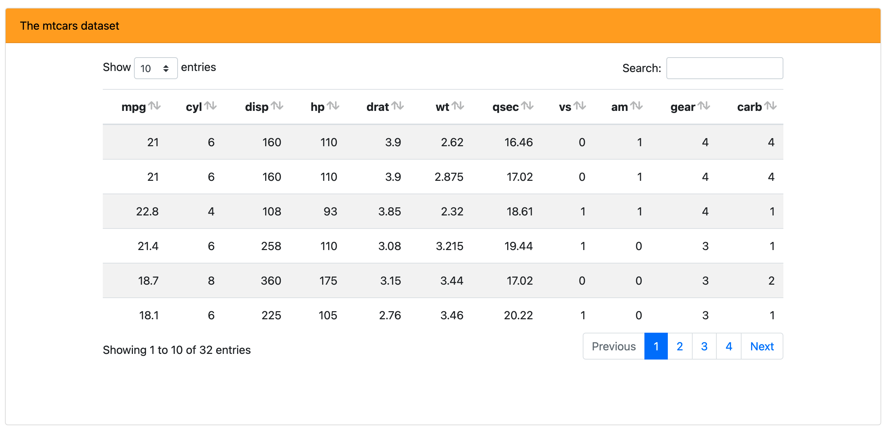
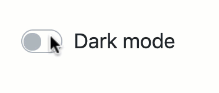
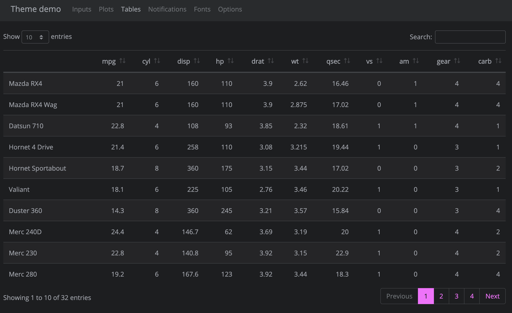

```{r, include=FALSE}
library(bslib)
knitr::opts_chunk$set(
  message = FALSE,
  collapse = TRUE,
  comment = "#>",
  out.width = "100%",
  fig.align = 'center',
  fig.width = 6,
  fig.asp = 0.618,  # 1 / phi
  fig.show = "hold"
)
include_vimeo <- function(id, width = "100%", height = "400") {
  url <- sprintf("https://player.vimeo.com/video/%s?title=0&byline=0&portrait=0", id)
  htmltools::tags$iframe(
    src = url,
    width = width,
    height = height,
    frameborder = "0",
    seamless = "seamless",
    webkitAllowFullScreen = NA,
    mozallowfullscreen = NA,
    allowFullScreen = NA
  )
}
```

```{scss, echo = FALSE}
div.info {
  padding: 2em;
  margin: 1em 0;
  padding-left: 100px;
  background-size: 70px;
  background-repeat: no-repeat;
  background-position: 15px center;
  min-height: 120px;
  color: #1f5386;
  background-color: #bed3ec;
  border: solid 5px #dfedff;
  background-image: url("infobox.svg");
  a {
    color: #e783b8;
  }
}
```

This article demonstrates how to create custom themes for Shiny apps, R Markdown documents, and more using `{bslib}`. For the sake of novelty, this article uses some Bootstrap 4 specific features like [Utility Classes], but some of the more basic options like Main Colors & Fonts and Sass variables are also available for Bootstrap 3.

## Main colors & fonts {#main-colors}

`bs_theme()` makes it easy to customize the main colors and fonts of most Shiny apps and R Markdown documents. Any `bs_theme()` may be provided to any [Shiny app](/index.html#shiny-usage) and any [R Markdown document](/index.html#r-markdown-usage) powered by Bootstrap, but for sake of demonstration here we'll provide it to `bs_theme_preview()`, which runs a Shiny app designed for previewing and customizing themes.

```r
library(bslib)
material <- bs_theme(
  bg = "#202123", 
  fg = "#B8BCC2", 
  primary = "#EA80FC", 
  secondary = "#00DAC6",
  success = "#4F9B29",
  info = "#28B3ED",
  warning = "#FD7424",
  danger = "#F7367E",
  base_font = font_google("Open Sans"),
  heading_font = font_google("Proza Libre"),
  code_font = font_google("Fira Code")
)
bs_theme_preview(material, with_themer = FALSE)
```

```{r, echo = FALSE}
knitr::include_graphics("material-dark.png")
```

Themes may also be interactively customized when `with_themer = TRUE`. This overlays `bs_themer()` on the demo app, an interactive theming tool to play with different colors, fonts, and various other main options. [See here](https://testing-apps.shinyapps.io/themer-demo/) for a live demo, but note that when `bs_themer()` runs locally, it emits R code in the console to replicate the interactive changes.

```r
bs_theme_preview(material, with_themer = TRUE)
```

```{r, echo = FALSE}
include_vimeo("465527125")
```

Among the main coloring choices in `bs_theme()`, `bg`, `fg`, and `primary` are by far the most important as they effect nearly every color on the page. In fact, `bg` and `fg` alone impact 100s of defaults --- everything from inputs to wells (e.g., `shiny::wellPanel()`, `shiny::inputPanel()`, etc) to navigation (e.g., `shiny::navbarPage()`, `shiny::tabsetPanel()`, etc) and more. The accent colors don't impact nearly as much, but `primary` does control the color for some important things like hyperlinks, `shiny::tabsetPanel()` links, accent/focus colors for inputs, and more. That being said, other accent colors can be handy for customizing things like `shiny::actionButton()` (defaults to the `secondary` color), `shiny::showNotification()` , or more generally any HTML content that leverages [Color Utility Classes](https://getbootstrap.com/docs/4.4/utilities/colors/).

There are 3 main controls for font families in `bs_theme()`, namely `base_font`, `heading_font`, and `code_font`. To focus and customize each setting, go to the "Fonts" tab in the top navbar, as well as in interactive themer. It's worth noting that the interactive themer has a special ability to render [Google Fonts](https://fonts.google.com) in real-time by downloading, caching, and importing font file(s) as needed (via `font_google()`).

```{r, echo = FALSE}

```

When using [web safe font combinations](https://www.w3schools.com/cssref/css_websafe_fonts.asp), it's ok to provide a character string of (comma-separated) font families (e.g., `bs_theme(base_font = '"Times New Roman", Times, serif')`. Otherwise, use one of the `font_google()`, `font_link()`, and/or `font_face()` helpers to include the relevant file(s) so the client's browser may render the font(s). `font_link()` and `font_face()` are fairly low-level interfaces to [the CSS web font API](https://developer.mozilla.org/en-US/docs/Learn/CSS/Styling_text/Web_fonts), but `font_google()` has the additional ability to download and cache font file(s), making it so that an internet connection is needed only for the first time a particular font is used.

::: {.info}
When choosing fonts, keep in mind that it's generally good practice to put serif fonts in `base_font`, sans-serif fonts in `heading_font`, and monospace fonts in `code_font`. If you aren't sure where to start, [this article](https://fontpair.co/featured) has a nice gallery of Google Font pairings. 
:::

## Theming variables {#sass-variables}

### Overview

In addition to [Main Colors & Fonts](#main-colors), `bs_theme()` also provides access to 100s of more specific theming options via [Bootstrap's Sass variables](https://getbootstrap.com/docs/4.4/getting-started/theming/#variable-defaults). [See here](bs4-variables.html) for the full table of variables available in Bootstrap 4. Towards the top of that table are more general theming options which impact more specific theming defaults (towards the bottom). For example, the general [`border-radius`](bs4-variables.html#border-radius) variable impacts the component specific [`btn-border-radius`](bs4-variables.html#btn-border-radius) and [`nav-tabs-border-radius`](bs4-variables.html#nav-tabs-border-radius) variables. General variables may also impact [Bootstrap's Utility Classes](https://getbootstrap.com/docs/4.4/utilities/borders/), which are used here to add padding and border around the `tabPanel()`'s content (more on Utility Classes later):

``` {.r}
# It's best practice to 'lock-in' the Bootstrap `version` when setting Sass variable(s) directly
theme <- bs_theme(version = 4, "border-width" = "3px", "border-radius" = 0)
ui <- fluidPage(
  theme = theme, 
  tabsetPanel(
    tabPanel("A", actionButton("a", "a"), class = "p-3 border border-top-0"),
    tabPanel("B", actionButton("b", "b"), class = "p-3 border border-top-0")
  )
)
shinyApp(ui, function(input, output) {})
```

```{r, echo = FALSE, out.width="67%"}

```

### Why Sass variables?

When a `bs_theme()` is used with Shiny or R Markdown, the [`{sass}`](https://rstudio.github.io/sass/) object underlying the theme object is [compiled into CSS](https://rstudio.github.io/sass/articles/sass.html#why) at run-time. Compared to custom theming by overlaying additional CSS rules (which, historically, has been the only way to implement custom themes), there are at least two huge benefits in the Sass based approach:

* [Sass variables](https://rstudio.github.io/sass/articles/sass.html#variables) (e.g., `$border-radius`) provide a useful abstraction to not only reduce the amount of code you need to write, but it also protects you from future changes in HTML/CSS markup that may end up breaking your CSS rules.
* Sass variables not only generate a custom build of Bootstrap CSS (thus, avoiding duplicated CSS rules), but it also gives 3rd party components the opportunity to provide better default styles based on underlying `{sass}` object (thanks to `{bslib}`'s [theming tools for custom components](#custom-components)). 
    * This shift in approach allows sophisticated, custom, components like `shiny::sliderInput()`, `shiny::dateRangeInput()`, `DT::datatable()`, etc. "just work" with custom and [dynamically updating themes](#dynamic-shiny).

### Sass variables in practice

In general, `bs_theme()` expects the value of any Sass variable to be a suitable [Sass expression](https://sass-lang.com/documentation/syntax/structure#expressions) like CSS [unit(s)](https://developer.mozilla.org/en-US/docs/Learn/CSS/Building_blocks/Values_and_units) (e.g., `3px`). Under the hood, it works by placing [Sass variables](https://rstudio.github.io/sass/articles/sass.html#variables) with a `!default` flag just _before_ Bootstrap's variables. For example:

```r
bs_theme("border-radius" = "3px")
#> $border-radius: 3px !default;
#> @import "/path/to/_variables.scss";
```

Since the [`_variables.scss` file](https://github.com/rstudio/bslib/blob/9e5f3a5/inst/lib/bs/scss/_variables.scss#L241) also includes `!default` flags, this allow you to set a new default for general variable(s) (`border-radius`) and have that default "cascade" to more specific variables (e.g., `$btn-border-radius`). It also allows other downstream users pick up your theme and "cascade" new values in the same way, for example:

```r
bs_theme("border-radius" = "3px") %>%
  bs_add_variables("border-radius" = "4px")
#> $border-radius: 4px !default;
#> $border-radius: 3px !default;
#> @import "/path/to/_variables.scss";
```

There is, however, one major drawback to placing variables before Bootstrap variables: you can't reference other Bootstrap variable(s) in the value. In this case, you'll need `bs_add_variables()` with `.where = "declarations"` which defines variables _after_ Bootstrap variables ([see here](https://rstudio.github.io/sass/articles/sass.html#layering) for more on composing Sass defaults, declarations, and rules). 

For example, [`nav-tabs-link-active-border-color`](bs4-variables.html#nav-tabs-link-active-border-color)'s default value is `$gray-300 $gray-300 $nav-tabs-link-active-bg`, which is why the top (1st value) as well as the left and right (2nd value) borders of the active tab appear gray. If instead, I wanted the top border to use the `$primary` variable (instead of `$gray-300`):

```r
theme <- bs_add_declarations(
  theme, "nav-tabs-link-active-border-color" = "$primary $gray-300 $nav-tabs-link-active-bg"
)
```

```{r, echo = FALSE, out.width="67%"}

```

With `bs_theme()`'s access to 100s of Sass variables, one may accomplish a fair amount of custom theming, especially when it comes to specifying custom colors, fonts, borders, and more. However, variables by themselves don't necessarily provide a complete solution for all your custom theming needs -- they fundamentally can't solve issues like whether or not to add spacing, borders, or background colors to custom HTML elements. For these, more adhoc design issues, Utility classes are very useful.

## Utility classes {#utility-classes}

Bootstrap 4 comes with a suite of handy utility classes for handling common yet fickle styling issues like [spacing](https://getbootstrap.com/docs/4.4/utilities/spacing/), [borders](https://getbootstrap.com/docs/4.4/utilities/borders/), [sizing](https://getbootstrap.com/docs/4.4/utilities/sizing/), [layout](https://getbootstrap.com/docs/4.4/utilities/flex/), [colors](https://getbootstrap.com/docs/4.4/utilities/colors/), and more.

### Add margin

If you look at [the source](https://github.com/rstudio/bslib/tree/master/inst/themer-demo) for the theme demo app, the `actionButton()` logic makes use of the margin spacing (`m-2`) to add some spacing between the buttons (they also make use of [button modifier classes](https://getbootstrap.com/docs/4.4/components/buttons/) to achieve their different background colors).

``` {.r}
actionButton("primary", "Primary", icon("product-hunt"), class = "btn-primary m-2")
actionButton("secondary", "Secondary (default)", class = "m-2")
actionButton("success", "Success", icon("check"), class = "btn-success m-2")
```

It's worth noting that `actionButton()`, like many other core shiny UI components, doesn't actually have an explicit `class` argument, but it does route implicit arguments (i.e., `...`) to its top-level HTML tag, which is why `actionButton(..., class = "btn-primary")` add the class in the appropriate place. Another place where this top-level `class` can be useful is for customizing the body of a `tabPanel()`.

### Add padding, borders, and alignment

By default, tabset panels don't come with any padding or border(s) around the body's content, which can make it appears though the content is just floating in space:

``` {.r}
tabsetPanel(
  tabPanel("One", "No padding"),
  tabPanel("Two", "Very sad!")
)
```

```{r, echo = FALSE, out.width="67%"}

```

We can help solve this issue by adding some padding the tab's content (`p-3`) as well as a nice border that matches up with the tab's borders.

``` {.r}
tab <- function(...) {
  shiny::tabPanel(..., class = "p-3 border border-top-0 rounded-bottom")
}
tabsetPanel(
  tab("One", "With padding"),
  tab("Two", "Nice!")
)
```

```{r, echo = FALSE, out.width="67%"}

```

And for `tabsetPanel(type="pills")` , it looks a bit better to have a full, rounded, border:

``` {.r}
pill <- function(...) {
  shiny::tabPanel(..., class = "p-3 border rounded")
}
tabsetPanel(
  type = "pills",
  pill("One", "With padding"),
  pill("Two", "Nice!")
)
```

```{r, echo = FALSE, out.width="67%"}

```

It's also worth noting that you can also add these classes to [rmarkdown tabsets](https://bookdown.org/yihui/rmarkdown-cookbook/html-tabs.html), like so:

```{r, echo = FALSE, out.width="50%"}
knitr::include_graphics("rmarkdown-tabs-source.png")
```

```{r, echo = FALSE}
knitr::include_graphics("rmarkdown-tabs.png")
```

Unfortunately, we can't always rely on the `class` argument placing itself on the HTML tag we need to achieve our styling goals. For example, we can't simply do `tabsetPanel(class = "justify-content-center", ...)` to [horizontally center](https://getbootstrap.com/docs/4.5/components/navs/#horizontal-alignment) a tabset. We can, however, leverage [Sass's \@extend rule](https://sass-lang.com/documentation/at-rules/extend) to essentially add utility classes to the relevant HTML element(s):

``` {.r}
fluidPage(
  theme = bs_theme() %>% 
    bs_add_rules("#my-nav { @extend .justify-content-center }"),
  tabsetPanel(
    type = "pills", id = "my-nav",
    pill("One", "With padding"),
    pill("Two", "Nice!")
  )
)
```

```{r, echo = FALSE, out.width="67%"}

```

### Add background color

Add a `bg-*` class to any HTML element to set not only its background color to a theme color (e.g., `primary`, `secondary`, etc), but note that it'll also make sure the foreground color properly contrasts the background color (i.e., the foreground switches from white/black intelligently based on dark/light background). Here we use `bg-primary` on a [BS4 card](https://getbootstrap.com/docs/4.4/components/card/#header-and-footer) containing a [`{DT}` table](https://rstudio.github.io/DT/).

```r
bs4_card <- function(body, title) {
  div(
    class = "card",
    div(class = "card-header bg-primary", title),
    div(class = "card-body d-flex justify-content-center", body)
  )
}

shinyApp(
  fluidPage(
    theme = bslib::bs_theme(primary = "orange"),
    uiOutput("dat")
  ),
  function(input, output) {
    output$dat <- renderUI({
      table <- DT::datatable(mtcars, fillContainer = TRUE, style = "bootstrap4", rownames = FALSE)
      bs4_card(table, "The mtcars dataset")
    })
  }
)
```

```{r, echo = FALSE, out.width="67%"}

```

### Create new utility classes

Bootstrap Sass also has a handful of [Sass maps](https://sass-lang.com/documentation/values/maps) which allow for easy creation and/or modification of utility classes. One such case is for creating your own background color utility classes, say `bg-flair` via the [`$theme-colors` map](https://github.com/rstudio/bslib/blob/9e5f3a5/inst/lib/bs/scss/_variables.scss#L76-L89). This could be useful if you wanted to let the `$primary` be the default `$blue`, but use a `bg-flair` instead of `bg-primary` to color the card's title:

```r
bs_theme("theme-colors" = "('flair': orange)")
```

```{r, echo = FALSE, out.width="67%"}

```

## Dynamic theming in Shiny {#dynamic-shiny}

With Shiny, it's possible to change the `{bslib}` theme after the initial page load via `session$setCurrentTheme()`. This can be useful for things like a dark mode [switch](https://getbootstrap.com/docs/4.4/components/forms/#switches) for your Shiny app:

``` {.r}
light <- bs_theme()
dark <- bs_theme(bg = "black", fg = "white", primary = "purple")
ui <- fluidPage(
  theme = light, 
  div(
    class = "custom-control custom-switch", 
    tags$input(
      id = "dark_mode", type = "checkbox", class = "custom-control-input",
      onclick = HTML("Shiny.setInputValue('dark_mode', document.getElementById('dark_mode').value);")
    ),
    tags$label(
      "Dark mode", `for` = "dark_mode", class = "custom-control-label"
    )
  )
)
server <- function(input, output, session) {
  observe({
    session$setCurrentTheme(
      if (isTRUE(input$dark_mode)) dark else light
    )
  })
}
shinyApp(ui, server)
```

```{r, echo = FALSE, out.width="50%"}

```

`session$setCurrentTheme()` "just works" for existing themeable components (e.g., "core" Shiny UI), but in order for it to work with custom components, the component's CSS must come from a "dynamic" HTML dependency (i.e., `bs_dependency_defer()`). To learn more, see [Custom components].

## Themeable components {#themeable-components}

HTML components that "just work" well with `{bslib}` (i.e., their default styles derive from `bs_theme()` settings) currently includes:

* All of "core" Shiny UI (e.g., `sliderInput()`, `selectInput()`, `tabPanel()`, `navbarPage()`, etc.) 
  * The one exception is `plotOutput()`, but in that case, `{thematic}` can be used to make plots themeable via `bs_theme()` (see [Plots]).

* All of `rmarkdown::html_document()` specific [features](https://bookdown.org/yihui/rmarkdown/html-document.html).

* Un-styled HTML content (e.g., `tags$input(type = "checkbox")`).

* Popular HTML table-making packages (currently **DT**, **reactable**, and **gt**, see [Tables])

* Your HTML component/widget? [Let us know if you have one](mailto:carson@rstudio.com)!
  * Learn how to create them in [Custom components].

At the moment, custom components (e.g., `{shinyWidgets}`, `{htmlwidgets}`, etc) aren't necessarily themeable (via `{bslib}`); but fortunately, `{bslib}` provides the tools for making custom content themeable. Over time, we're hoping package authors will leverage these tools to make their custom components themeable by default, but app authors can also leverage these tools to translate themes to whatever styling API they need.

### Plots {data-link="Plots"}

`{bslib}` itself doesn't do anything special to make static R plots respect Bootstrap CSS, but thanks to the [`{thematic}` package](https://rstudio.github.io/thematic/), you can include `thematic_shiny()` in your Shiny apps and `thematic_rmd()` in your R Markdown documents to gain new, intelligent, styling defaults based on the `{bslib}` theme (BTW, `{thematic}` can also be used to theme plots without Bootstrap). Note that, the demo app included with `bs_theme_preview()` includes a call to `thematic_shiny(font = "auto")` to enable real-time theming of plots.

``` {.r}
bs_theme_preview(
  bs_theme(bg = "#444444", fg = "#E4E4E4", primary = "#E39777")
)
```

```{r, echo = FALSE}
include_vimeo("411238499")
```

### Tables

For a preview of custom HTML tables that can derive their default styles from a `{bslib}` theme, navigate to the "Tables" tab of the demo app:

``` {.r}
bs_theme_preview(material)
```

```{r, echo = FALSE}

```

### Custom components {#custom-components}

#### A basic themeable component

Before going through a full-blown [dynamically themeable](#dynamic-shiny) custom component, let's start from a relatively straight-forward example of implementing a custom `person()` component. Say we have the following R function to generate some HTML with classes that we'll write custom Sass/CSS styles for:

``` {.r}
person <- function(name, title, company) {
  div(
    class = "person",
    h3(class = "name", name),
    div(class = "title", title),
    div(class = "company", company)
  )
}
```

And here's some custom Sass to style those classes. Since these Sass rules listen to Bootstrap Sass variables like `$gray-600`, `person()` styles works great with different `bs_theme()` input:

``` {.css}
.person {
  display: inline-block;
  padding: $spacer;
  border: $border-width solid $border-color;
  @include border-radius;
  @include box-shadow;
  outline: 0;
  width: 300px;
  .title {
    font-weight: bold;
  }
  .title, .company {
    color: $gray-600;
  }
  margin: $grid-gutter-width;
  margin-right: 0;
  // On mobile, span entire width
  @include media-breakpoint-down(sm) {
    display: block;
    width: auto;
    margin-right: $grid-gutter-width;
  }
}
.person:last-of-type {
  margin-right: $grid-gutter-width;
}
```

If we were to save these Sass rules to a file named `person.scss`, then we can then `bs_add_rules()` to the `bs_theme()` and use our themeable `person()` component like so:

``` {.r}
ui <- fluidPage(
  theme = bs_theme(bg = "#002B36", fg = "#EEE8D5") %>%
    bs_add_rules(sass::sass_file("person.scss")),
  person("Andrew Carnegie", "Owner", "Carnegie Steel Company"),
  person("John D. Rockefeller", "Chairman", "Standard Oil")
)
shinyApp(ui, function(input, output) {})
```

```{r, echo = FALSE, out.width="67%"}
knitr::include_graphics("person.png")
```

#### Dynamically themeable component

To make the custom `person()` component *dynamically* themeable (i.e., make it work with `session$setCurrentTheme()`), we need an R function that generates an `htmltools::htmlDependency()` from a given `theme`. While not required, suppose this function, `person_dependency`, lives in an R package called `{mypkg}` which includes the `person.scss` (and pre-compiled `person.css`) file under the `inst/` directory. Then we could do the following:

``` {.r}
name <- "person"
version <- "1.0.0"
person_dependency <- function(theme) {
  if (is_bs_theme(theme)) {
    scss <- system.file(package = "mypkg", "person.scss")
    bs_dependency(
      input = sass::sass_file(scss),
      theme = theme,
      name = name,
      version = version
    )
  } else {
    htmlDependency(
      name = name,
      version = version,
      stylesheet = "person.css",
      package = "mypkg",
      all_files = FALSE
    )
  }
}

#' @export
person <- function(name, title, company) {
  div(
    class = "person",
    h3(class = "name", name),
    div(class = "title", title),
    div(class = "company", company),
    bs_dependency_defer(person_dependency)
  )
}
```

Note that when `theme` is a `bs_theme()` object, then `person.scss` is compiled with Bootstrap Sass variables and mixins included via `bs_dependency()` (which returns the compiled CSS as an `htmlDependency()`). Otherwise, if `theme` is *not* a `bs_theme()` object, then `person()` is being used in a context where `{bslib}` is not relevant, so a pre-compiled CSS file is returned instead. Pre-complied CSS isn't necessarily a requirement, but it's a good idea for increasing performance and reducing software dependencies for end users.

#### HTML widgets

For `{htmlwidgets}` that can be themed via CSS, we recommend supplying a `bs_dependency_defer()` to the `dependencies` argument of `createWidget()` (similar to the `person()` component from the last section), which will make the widget dynamically themeable. For widgets that can *not* be themed via CSS, the best option may be to query the active theme inside a `preRenderHook()` via `bs_current_theme()`, and then translate any relevant information to the widget's instance data, for example:

```r
my_widget <- function(...) {
  createWidget(
    name = "mywidget", ...,
    preRenderHook = my_widget_hook
  )
}
my_widget_hook <- function(instance) {
  theme <- bslib::bs_current_theme()
  if (!bslib::is_bs_theme(theme)) {
    return(instance)
  }
  instance$x$theme <- modifyList(
    instance$x$theme, as.list(
      bslib::bs_get_variables(theme, c("bg", "fg"))
    )
  )
  instance
}
```
