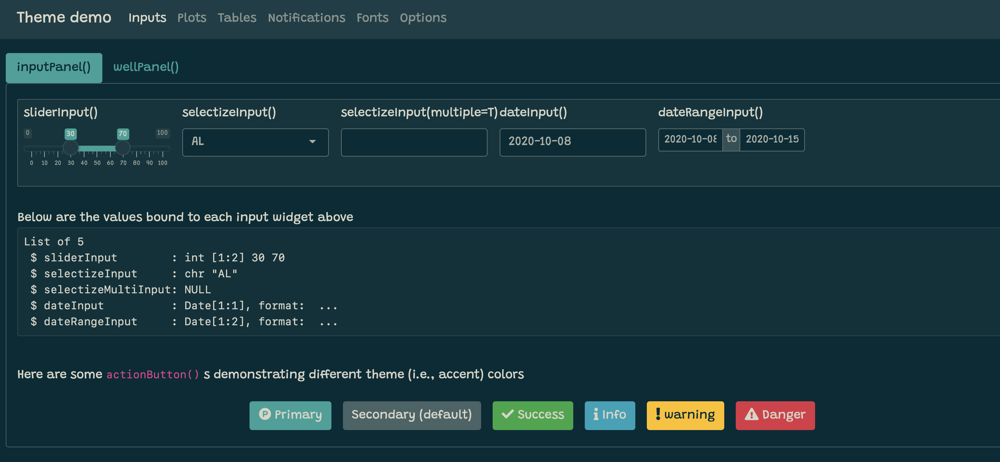
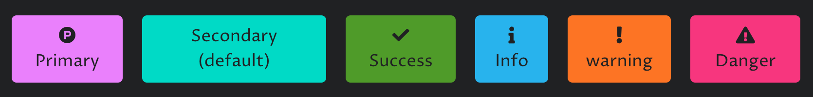

```{r, include=FALSE}
library(bootstraplib)
knitr::opts_chunk$set(
  message = FALSE,
  collapse = TRUE,
  comment = "#>",
  out.width = "100%",
  fig.align = 'center',
  fig.width = 6,
  fig.asp = 0.618,  # 1 / phi
  fig.show = "hold"
)
include_vimeo <- function(id, width = "100%", height = "400") {
  url <- sprintf("https://player.vimeo.com/video/%s?title=0&byline=0&portrait=0", id)
  htmltools::tags$iframe(
    src = url,
    width = width,
    height = height,
    frameborder = "0",
    seamless = "seamless",
    webkitAllowFullScreen = NA,
    mozallowfullscreen = NA,
    allowFullScreen = NA
  )
}
```

```{scss, echo = FALSE}
div.info {
  padding: 2em;
  margin: 1em 0;
  padding-left: 100px;
  background-size: 70px;
  background-repeat: no-repeat;
  background-position: 15px center;
  min-height: 120px;
  color: #1f5386;
  background-color: #bed3ec;
  border: solid 5px #dfedff;
  background-image: url("infobox.svg");
}
div.warning {
  padding: 2em;
  margin: 1em 0;
  padding-left: 100px;
  background-size: 70px;
  background-repeat: no-repeat;
  background-position: 15px center;
  min-height: 120px;
  color: white;
  background-color: #F34C22;
  border: solid 5px #F36642;
  background-image: url("warning.svg");
}
```

This article demonstrates how to create custom themes for Shiny apps, R Markdown documents, and more using `{bootstraplib}`. For the sake of novelty, this article uses some Bootstrap 4 specific features like [Utility Classes], but some of the more basic options like Main Colors & Fonts and Sass variables are also available for Bootstrap 3.

## Main colors & fonts

`bs_theme()` makes it easy to customize the main colors and fonts of Bootstrap CSS. Here you can set the main background, foreground, and accent colors as well as the base, heading, and code fonts. Once you create a theme, you can provide it to `bs_theme_preview()` to run a Shiny app designed for previewing (and further customizing) the theme.

``` {.r}
library(bootstraplib)
material <- bs_theme(
  bg = "#202123", 
  fg = "#B8BCC2", 
  primary = "#EA80FC", 
  secondary = "#00DAC6",
  success = "#4F9B29",
  info = "#28B3ED",
  warning = "#FD7424",
  danger = "#F7367E",
  base_font = "Proza Libre",
  heading_font = "Open Sans",
  code_font = "Fira Code"
)
bs_theme_preview(material, with_themer = FALSE)
```

```{r, echo = FALSE}
knitr::include_graphics("material-dark.png")
```

If you want, you can also preview the theme with an interactive theming tool to test out different main colors, fonts, and various other main options. See here for a live demo of the app, but note that if you're to run this locally, everytime a theming change is made, the app emits R code in the console to replicate the changes.

``` {.r}
bs_theme_preview(material, with_themer = TRUE)
```

```{r, echo = FALSE}
include_vimeo("465527125")
```

Among the main theming choices, `bg`, `fg`, `primary`, and `base_font` are by far the most important as they effect nearly everything on the page. In fact, `bg` and `fg` alone impact 100s of defaults --- everything from inputs to wells (e.g., `shiny::wellPanel()`, `shiny::inputPanel()`, etc) to navigation (e.g., `shiny::navbarPage()`, `shiny::tabsetPanel()`, etc) and more. The accent colors don't impact nearly as much, but `primary` does control the color for some important things like hyperlinks, `shiny::tabsetPanel()` links, accent/focus colors for inputs, and more. That being said, other accent colors can be handy for customizing things like `shiny::actionButton()` (defaults to the `secondary` color), `shiny::showNotification()` , or more generally any HTML content that leverages [Color Utility Classes](https://getbootstrap.com/docs/4.4/utilities/colors/).

::: {.warning}
Setting font(s) doesn't guarantee those fonts may actually be rendered in the browser. When it comes to a Google Font like Open Sans, you can provide the fonts with either an [online](https://developers.google.com/fonts/docs/getting_started) or [offline](https://cloud.r-project.org/web/packages/gfonts/index.html) attachment.
:::

## Sass variables

::: {.info}
If you aren't already familiar with how Sass variables work, we highly recommend reading the first couple paragraphs of [this article](https://rstudio.github.io/sass/articles/sass.html).
:::

Any of the main color and font settings work for any Bootstrap `version`, but `bs_theme()` also allows control over specific [Bootstrap Sass variables](https://getbootstrap.com/docs/4.5/getting-started/theming/#variable-defaults) that are likely to different across `versions`. Thus, it's best practice to 'lock-in' the Bootstrap `version` when setting Sass variable(s) directly. Here we set Bootstrap 4's [\$font-size-base variable](https://github.com/rstudio/bootstraplib/blob/0e936dc/inst/lib/bootstrap/scss/_variables.scss#L282) to increase the sizing of all the fonts on a solarized theme.

``` {.r}
theme_solar <- bs_theme(
  bg = "#002B36", 
  fg = "#EEE8D5",
  primary = "#2AA198",
  base_font = "Grandstander",
  version = "4+3",
  "font-size-base" = "1.1rem"
)
bs_theme_preview(theme_solar, with_themer = FALSE)
```

```{r, echo = FALSE}

```

If you skim through the full list of [Bootstrap 4](https://github.com/rstudio/bootstraplib/blob/master/inst/lib/bootstrap/scss/_variables.scss) ([or 3](https://github.com/rstudio/bootstraplib/blob/master/inst/lib/bootstrap-sass/assets/stylesheets/bootstrap/_variables.scss)) Sass variables, you'll notice *lots* of variable settings. Towards the top are the main settings like [the `bg` / `fg` color system](https://github.com/rstudio/bootstraplib/blob/0e936dc/inst/lib/bootstrap/scss/_variables.scss#L6-L34) and [theme colors](https://github.com/rstudio/bootstraplib/blob/0e936dc/inst/lib/bootstrap/scss/_variables.scss#L36-L89), but as you work your way down the file, you'll notice variables becoming more and more specific. For example, [`$progress-bar-bg` defaults to `primary`](https://github.com/rstudio/bootstraplib/blob/0e936dcd/inst/lib/bootstrap/scss/_variables.scss#L1003), but we can change that default directly, which will customize `shiny::Progress`:

``` {.r}
bs_theme("progress-bar-bg" = "orange") %>%
  bs_theme_preview()
```

```{r, echo=FALSE, out.width="50%"}
knitr::include_graphics("progress-orange.png")
```

This works because `orange` is a valid CSS color string, but what happens if we attempt to define `$progress-bar-bg` using other Bootstrap Sass variable(s)? For example, instead of `orange`, let's set it to `$gray-800` (that is, 80% `fg` and 20% `bg`).

``` {.r}
bs_theme("progress-bar-bg" = "$gray-800") %>%
  bs_theme_preview()
```

``` {.r}
#> Error: Undefined variable: "$gray-800"
```

This doesn't work because `bs_theme()` places variable defaults *before* Bootstrap variable definitions; however, if we use `bs_add_variables()` with `.where = "declarations"`, then the variable is placed *after* Bootstrap variables, making it possible to reference Bootstrap variables (just make sure the variable definition doesn't include a `!default` flag)!

``` {.r}
bs_theme("progress-bar-bg" = "$gray-800")$defaults
```

``` {.css}
/* Sass */
$progress-bar-bg: $gray-800 !default;
@import "bootstrap/scss/_variables.scss";
```

``` {.r}
bs_theme() %>%
  bs_add_variables(
    "progress-bar-bg" = '$gray-800', 
    .where = "declarations"
  ) %>%
  bs_theme_preview()
```

```{r, echo = FALSE, out.width="50%"}
knitr::include_graphics("progress-gray.png")
```

## Color contrasting

Bootstrap tries its best to dynamically flip between an appropriate `bg` or `fg` for text colors that are overlaid on accent colors, but it doesn't always get the contrast quite right. For example, if we return to our `material` theme and look closer at the button styles:

```{r, echo = FALSE, out.width="50%"}
knitr::include_graphics("material-buttons-before.png")
```

Turns out, in this case, we can fix the issue by decreasing [`$yiq-contrasted-threshold`](https://github.com/rstudio/bootstraplib/blob/0e936d/inst/lib/bootstrap/scss/_variables.scss#L95) from 150 to 100.

``` {.r}
material %>%
  bs_theme_update("yiq-contrasted-threshold" = 100) %>%
  bs_theme_preview()
```

```{r, echo = FALSE, out.width="50%"}

```

As we'll learn in [Custom Components], Bootstrap 4 also provides a color contrasting function, which is useful for leveraging dynamic contrasting in your own rules. It's also worth noting that, sometimes, this general and somewhat arbitrary contrasting threshold doesn't work for every color in a color-scheme, but in that case, you can leverage the [`text-light` and `text-dark` utility classes](https://getbootstrap.com/docs/4.4/utilities/colors/).

## Utility classes

Bootstrap 4 comes with a suite of handy utility classes for handling common yet fickle styling issues like [spacing](https://getbootstrap.com/docs/4.4/utilities/spacing/), [borders](https://getbootstrap.com/docs/4.4/utilities/borders/), [sizing](https://getbootstrap.com/docs/4.4/utilities/sizing/), [layout](https://getbootstrap.com/docs/4.4/utilities/flex/), [colors](https://getbootstrap.com/docs/4.4/utilities/colors/), and more. In fact, if you look at [the source](https://github.com/rstudio/bootstraplib/tree/master/inst/themer-demo) for the theme demo app, the `actionButton()` logic makes use of the margin spacing (`m-2`) to add some spacing between the buttons (they also make use of [button modifier classes](https://getbootstrap.com/docs/4.4/components/buttons/) to achieve their different background colors).

``` {.r}
actionButton("primary", "Primary", icon("product-hunt"), class = "btn-primary m-2")
actionButton("secondary", "Secondary (default)", class = "m-2")
actionButton("success", "Success", icon("check"), class = "btn-success m-2")
```

It's worth noting that `actionButton()`, like many other core shiny UI components, doesn't actually have an explicit `class` argument, but it does route implicit arguments (i.e., `...`) to it's top-level HTML tag, which is why `actionButton(..., class = "btn-primary")` add the class in the appropriate place. Another place where this top-level `class` can be useful is for customizing the body of a `tabPanel()` .

By default, tabset panels don't come with any padding or border(s) around the body's content, which can make it appears though the content is just floating in space:

``` {.r}
tabsetPanel(
  tabPanel("One", "No padding"),
  tabPanel("Two", "Very sad!")
)
```

```{r, echo = FALSE, out.width="67%"}
knitr::include_graphics("tab-before.png")
```

We can help solve this issue by adding some padding the tab's content (`p-3`) as well as a nice border that matches up with the tab's borders.

``` {.r}
tab <- function(...) {
  shiny::tabPanel(..., class = "p-3 border border-top-0 rounded-bottom")
}
tabsetPanel(
  tab("One", "With padding"),
  tab("Two", "Nice!")
)
```

```{r, echo = FALSE, out.width="67%"}
knitr::include_graphics("tab-after.png")
```

And for `tabsetPanel(type="pills")` , it looks a bit better to have a full, rounded, border:

``` {.r}
pill <- function(...) {
  shiny::tabPanel(..., class = "p-3 border rounded")
}
tabsetPanel(
  type = "pills",
  pill("One", "With padding"),
  pill("Two", "Nice!")
)
```

```{r, echo = FALSE, out.width="67%"}
knitr::include_graphics("pills.png")
```

It's also worth noting that you can also add these classes to [rmarkdown tabsets](https://bookdown.org/yihui/rmarkdown-cookbook/html-tabs.html), like so:

```{r, echo = FALSE, out.width="50%"}
knitr::include_graphics("rmarkdown-tabs-source.png")
```

```{r, echo = FALSE}
knitr::include_graphics("rmarkdown-tabs.png")
```

Unfortunately, we can't generally rely on the `class` argument placing classes on the top-level HTML tag to achieve our styling goals and may need to target children of the top-level tag. For example, if we wanted to horizontally align a `tabsetPanel()`, we'd have to append a class to it's first child (i.e., the `.nav` container).

``` {.r}
tabsetPanelCentered <- function(...) {
  x <- tabsetPanel(...)
  x$children[[1]] <- tagAppendAttributes(
    x$children[[1]], class = "justify-content-center"
  )
  x
}
tabsetPanelCentered(
  type = "pills",
  pill("One", "With padding"),
  pill("Two", "Nice!")
)
```

```{r, echo = FALSE, out.width="67%"}
knitr::include_graphics("pills.png")
```

Beware, however, that `tabsetPanelCentered()` makes very strong assumptions about the HTML structure of `tabsetPanel()` . It'd be better practice to leverage the power of [Sass's \@extend rule](https://sass-lang.com/documentation/at-rules/extend) to make all navs horizontally centered:

``` {.r}
fluidPage(
  theme = bs_theme() %>% 
    bs_add_rules(".nav { @extend .justify-content-center }"),
  tabsetPanel(
    type = "pills",
    pill("One", "With padding"),
    pill("Two", "Nice!")
  )
)
```

Or scoped to a specific `tabsetPanel()` 's `id`:

``` {.r}
fluidPage(
  theme = bs_theme() %>%
    bs_add_rules("#my-nav { @extend .justify-content-center }"),
  tabsetPanel(
    type = "pills", id = "my-nav",
    pill("One", "With padding"),
    pill("Two", "Nice!")
  )
)
```

## Dynamic theming in Shiny {#dynamic-shiny}

With Shiny, it's possible to change the `{bootstraplib}` theme after the initial page load via `session$setCurrentTheme()`. This can be useful for things like a dark mode [switch](https://getbootstrap.com/docs/4.4/components/forms/#switches) for your Shiny app:

``` {.r}
light <- bs_theme()
dark <- bs_theme(bg = "black", fg = "white", primary = "purple")
ui <- fluidPage(
  theme = light, 
  div(
    class = "custom-control custom-switch", 
    tags$input(
      id = "dark_mode", type = "checkbox", class = "custom-control-input",
      onclick = HTML("Shiny.setInputValue('dark_mode', document.getElementById('dark_mode').value);")
    ),
    tags$label(
      "Dark mode", `for` = "dark_mode", class = "custom-control-label"
    )
  )
)
server <- function(input, output, session) {
  observe({
    session$setCurrentTheme(
      if (isTRUE(input$dark_mode)) dark else light
    )
  })
}
shinyApp(ui, server)
```

```{r, echo = FALSE, out.width="50%"}
knitr::include_graphics("dark-mode.gif")
```

`session$setCurrentTheme()` "just works" for existing themable components (e.g., "core" Shiny UI), but in order for it to work with custom components, the component's CSS must come from a "dynamic" HTML dependency (i.e., `bs_dependency_defer()`). To learn more, see the section on themable custom components.

## Themable components

`{bootstraplib}` themes "just work" for all "core" Shiny UI (e.g., `sliderInput()`, `selectInput()`, `tabPanel()`, `navbarPage()`, etc.) as well as any un-styled HTML content (e.g., `tags$input(type = "checkbox")`). One exception to that rule is `plotOutput()` / `renderPlot()`, but in that case, `{thematic}` helps to translate the relevant CSS to [Plots].

At the moment, custom components (e.g., `{shinyWidgets}`, `{htmlwidgets}`, etc) aren't necessarily themeable (via `{bootstraplib}`); but fortunately, `{bootstraplib}` provides the tools for making custom content themeable. Over time, we're hoping package authors will leverage these tools to make their custom components themeable by default, but app authors can also leverage these tools to translate themes to whatever styling API they need.

### Plots {data-link="Plots"}

`{bootstraplib}` itself doesn't do anything special to make static R plots respect Bootstrap CSS, but thanks to the [`{thematic}` package](https://rstudio.github.io/thematic/), you can include `thematic_shiny()` in your Shiny apps and `thematic_rmd()` in your R Markdown documents to gain new, intelligent, styling defaults based on the `{bootstraplib}` theme (BTW, `{thematic}` can also be used to theme plots without Bootstrap). Note that, the demo app included with `bs_theme_preview()` includes a call to `thematic_shiny(font = "auto")` to enable real-time theming of plots.

``` {.r}
bs_theme_preview(
  bs_theme(bg = "#444444", fg = "#E4E4E4", primary = "#E39777")
)
```

```{r, echo = FALSE}
include_vimeo("411238499")
```

As you'll see in the next section on [Tables], with a bit of effort, it's possible to translate `{bootstraplib}` theme settings to other package's theme setting today, but our hope is that with time and help from the R community, we'll get most popular packages working well `{bootstraplib}` .

### Tables

Shiny and R Markdown tables (e.g., `shiny::dataTableOutput()` , `rmarkdown::paged_table()`, etc) "just work" with `{bootstraplib}` themes; however, **DT** tables currently need either `style='bootstrap4'` (or `style='bootstrap'`) in `datatable()`. In [a future version](https://github.com/rstudio/DT/pull/852) of **DT**, this won't be necessary.

``` {.r}
bs_theme_preview(material)
```

```{r, echo = FALSE}
knitr::include_graphics("DT-material.png")
```

To get `{bootstraplib}` themes working well with other table-making packages like `{reactable}`, you currently need to translate the `{bootstraplib}` theme via `bs_get_variables()` and either `shiny::getCurrentTheme()` (in a Shiny app) or `bs_global_get()` (in an R Markdown doc):

``` {.r}
output$reactable <- reactable::renderReactable({
  get_var <- function(var) {
    unname(bs_get_variables(shiny::getCurrentTheme(), var))
  }
  reactable::reactable(
    mtcars, theme = reactable::reactableTheme(
      color = get_var("table-color"),
      backgroundColor = get_var("body-bg")
    )
  )
})
```

### Custom components

#### A basic themable component

Before going through a full-blown [dynamically themable](#dynamic-shiny) custom component, let's start from a relatively straight-forward example of implementing a custom `person()` component. Say we have the following R function to generate some HTML with classes that we'll write custom Sass/CSS styles for:

``` {.r}
person <- function(name, title, company) {
  div(
    class = "person",
    h3(class = "name", name),
    div(class = "title", title),
    div(class = "company", company)
  )
}
```

And here's some custom Sass to style those classes. Since these Sass rules listen to Bootstrap Sass variables like `$gray-600`, `person()` styles works great with different `bs_theme()` input:

``` {.css}
.person {
  display: inline-block;
  padding: $spacer;
  border: $border-width solid $border-color;
  @include border-radius;
  @include box-shadow;
  outline: 0;
  width: 300px;
  .title {
    font-weight: bold;
  }
  .title, .company {
    color: $gray-600;
  }
  margin: $grid-gutter-width;
  margin-right: 0;
  // On mobile, span entire width
  @include media-breakpoint-down(sm) {
    display: block;
    width: auto;
    margin-right: $grid-gutter-width;
  }
}
.person:last-of-type {
  margin-right: $grid-gutter-width;
}
```

If we were to save these Sass rules to a file named `person.scss`, then we can then `bs_add_rules()` to the `bs_theme()` and use our themeable `person()` component like so:

``` {.r}
ui <- fluidPage(
  theme = bs_theme(bg = "#002B36", fg = "#EEE8D5") %>%
    bs_add_rules(sass::sass_file("person.scss")),
  person("Andrew Carnegie", "Owner", "Carnegie Steel Company"),
  person("John D. Rockefeller", "Chairman", "Standard Oil")
)
shinyApp(ui, function(input, output) {})
```

```{r, echo = FALSE, out.width="67%"}
knitr::include_graphics("person.png")
```

#### Dynamically themable component

To make the custom `person()` component *dynamically* themable (i.e., make it work with `session$setCurrentTheme()`), we need an R function that generates an `htmltools::htmlDependency()` from a given `theme`. While not required, suppose this function, `person_dependency`, lives in an R package called `{mypkg}` which includes the `person.scss` (and pre-compiled `person.css`) file under the `inst/` directory. Then we could do the following:

``` {.r}
name <- "person"
version <- "1.0.0"
person_dependency <- function(theme) {
  if (is_bs_theme(theme)) {
    scss <- system.file(package = "mypkg", "person.scss")
    bs_dependency(
      input = sass::sass_file(scss),
      theme = theme,
      name = name,
      version = version
    )
  } else {
    htmlDependency(
      name = name,
      version = version,
      stylesheet = "person.css",
      package = "mypkg",
      all_files = FALSE
    )
  }
}

#' @export
person <- function(name, title, company) {
  div(
    class = "person",
    h3(class = "name", name),
    div(class = "title", title),
    div(class = "company", company),
    bs_dependency_defer(person_dependency)
  )
}
```

Note that when `theme` is a `bs_theme()` object, then `person.scss` is compiled with Bootstrap Sass variables and mixins included via `bs_dependency()` (which returns the compiled CSS as an `htmlDependency()`). Otherwise, if `theme` is *not* a `bs_theme()` object, then `person()` is being used in a context where `{bootstraplib}` is not relevant, so a pre-compiled CSS file is returned instead. Pre-complied CSS isn't necessarily a requirement, but it's a good idea for increasing performance and reducing software dependencies.

#### HTML widgets

##### For developers

For `{htmlwidgets}` that can be themed via CSS, we recommend supplying a `bs_dependency_defer()` to the `dependencies` argument of `createWidget()` (similar to the `person()` component from the last section). This'll make your widget dynamically themable. For widgets that can *not* be themed via CSS, your only option may be to query the active theme inside a `preRenderHook()` and translate any relevant information to the widget instance,

``` {.r}
my_widget <- function(...) {
  createWidget(
    name = "mywidget", ...,
    # TODO: can we make this work with dynamic theming?
    preRenderHook = function(instance) {
       instance$theme <- shiny::getCurrentTheme() %||% bs_global_theme()
       instance
    }
  )
}
```

##### For users

For users of an `{htmlwidgets}` package that wish to make their widgets themable, your only option at the moment is to use a strategy similar to the one demonstrated for `{reactable}` in the [Tables] section.
