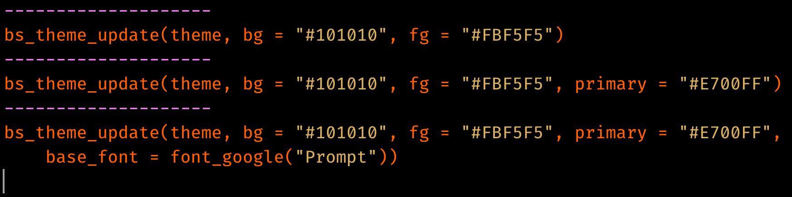
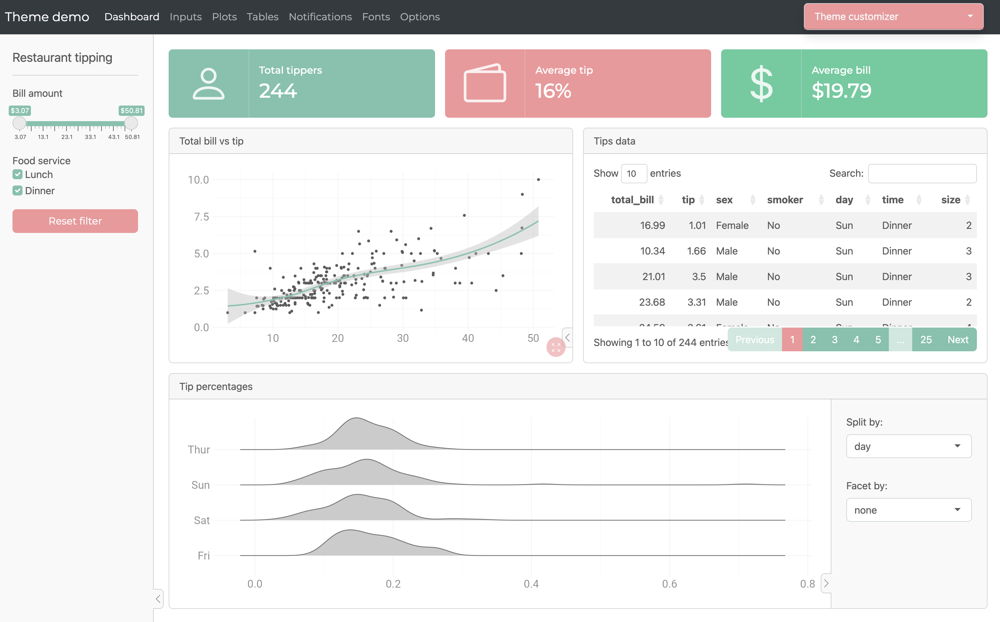
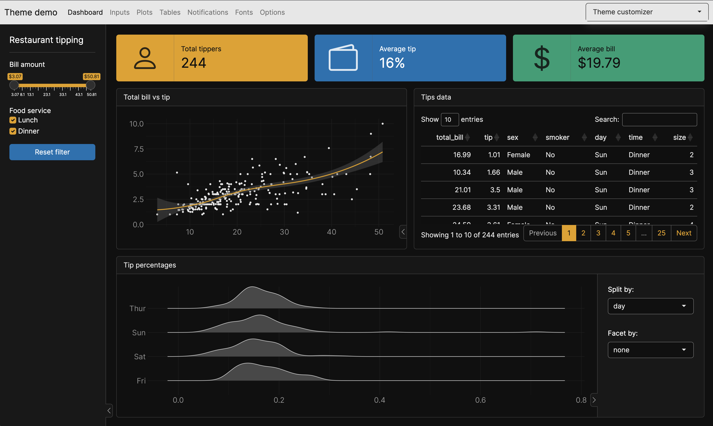
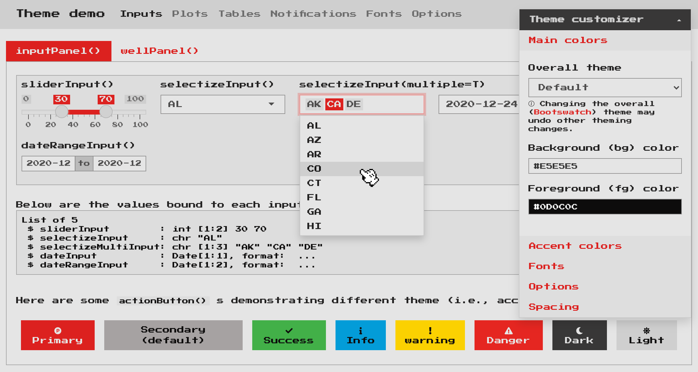
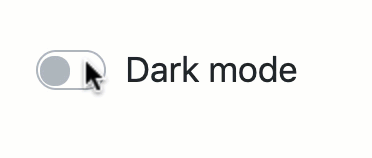

```{r, include=FALSE}
source(
  rprojroot::find_package_root_file("vignettes/_common.R")
)
knitr::opts_chunk$set(
  out.width = "100%",
  fig.width = 6,
  fig.asp = 0.618,  # 1 / phi
  fig.show = "hold"
)
```

```{scss, echo = FALSE}
@media (min-width: 800px) {
  .usage {
    display: grid;
    grid-template-columns: 1fr 1fr;
    gap: 0.5rem;
    align-items: center;
  }
}
```


This article provides a general overview of theming techniques available in `{bslib}`.


## Real-time theming {#real-time}

To get started theming, consider overlaying a real-time theming widget on your Shiny app (or `runtime: shiny` R Markdown document). This is a great way to experiment with different [Bootswatch](#bootswatch) themes, [main colors](#main-colors), fonts, and more. To add the widget, call `bs_themer()` in a Shiny runtime content (i.e., within the `server` function) and also make sure the app/document [uses `{bslib}` for its Bootstrap dependency](../any-project).

<div class="usage">
```r
# Shiny example
ui <- page_sidebar(
  title = "My app"
)

server <- function(input, output) {
  bs_themer()

}

shinyApp(ui, server)
```

````
# R Markdown example
---
runtime: shiny
output:
  html_document:
    theme:
      bslib: true
---

`r ''````{r}
bslib::bs_themer()
```

````
</div>

If you don't have a particular app or document in mind, you can also use `bs_theme_preview()` to create a demo Shiny app with the theming widget already overlayed ([see here](https://bslib.shinyapps.io/themer-demo) for a hosted version):

```r
bs_theme_preview()
```

```{r, echo = FALSE}
#| fig.alt: >
#|   An animation showing bslib theming app. As the user changes the Bootswatch
#|   theme and Bootstrap settings, the app's appearance changes in real-time.
knitr::include_graphics("themer.gif")
```


When running the theming widget locally, you'll see output like this in your R console (in R Markdown, you'll see YAML output instead of R code) to reproduce the theming changes:

```{r, echo = FALSE, out.width="80%"}
#| fig.alt: Console output showing the R code to reproduce the theming changes.

```

## Bootswatch themes {#bootswatch}

Any [Bootswatch](https://bootswatch.com) theme is available through `bs_theme()`'s `bootswatch` argument. You may already be familiar with using these "pre-packaged" themes via the  `{shinythemes}` package (or via the `theme` parameter in R Markdown). Those older approaches only provide [Bootswatch 3 themes](https://bootswatch.com/3), but with `{bslib}`, you can use newer themes like [minty](https://bootswatch.com/minty) or [zephyr](https://bootswatch.com/zephyr).

<div class="usage">
```r
# Shiny example
page_sidebar(
  theme = bs_theme(bootswatch = "minty")
)
```
```r
# R Markdown example
---
output:
  html_document:
    theme:
      bootswatch: minty
---
```
</div>

```{r, echo = FALSE}
#| fig.alt: A screenshot of the minty Bootswatch theme.

```

## Main colors & fonts {#main-colors}

`bs_theme()` also provides named arguments for customizing the main background color (`bg`), foreground color (`fg`), accent colors (`primary`, `secondary`, etc), and fonts (`base_font`, `heading_font`, `code_font`, etc). Here's an example of using a subset of these named arguments to implement a dark mode with custom fonts:

::: usage
```r
# Shiny example
page_sidebar(
  title = "My app",
  bs_theme(
    bg = "#101010",
    fg = "#FFF",
    primary = "#E69F00",
    secondary = "#0072B2",
    success = "#009E73",
    base_font = font_google("Inter"),
    code_font = font_google("JetBrains Mono")
  ),
  ...
)
```

```r
# R Markdown example
---
output:
  html_document:
    theme:
      bg: "#101010"
      fg: "#FFF"
      primary: "#E69F00"
      secondary: "#0072B2"
      success: "#009E73"
      base_font:
        google: "Prompt"
      code_font:
        google: "JetBrains Mono"
---
```
:::

```{r, echo = FALSE}
#| fig.alt: A screenshot showing a dark mode theme with custom fonts.

```

Among all the coloring options in `bs_theme()`, `bg`, `fg`, and `primary` are by far the most influential as they effect nearly every color on the page. In fact, `bg` and `fg` alone impact 100s of defaults --- everything from text color, `card()`s, `accordion()`s, and much more. The accent colors don't impact nearly as much, but `primary` does control the color for some important things like hyperlinks, `navset_pill()` links, accent/focus colors for inputs, and more. That being said, other accent colors can be handy for customizing things like `shiny::actionButton()` (defaults to the `secondary` color), `shiny::showNotification()` , or more generally any HTML content that leverages [Color Utility Classes](https://getbootstrap.com/docs/5.0/utilities/colors/).

::: {.callout .callout-note}
<h3 data-toc-skip>Choosing colors</h3>

When choosing `bg` and `fg` colors, keep in mind that it's generally a good idea to pick colors with a similar hue but a large difference in their luminance.
:::

`bs_theme()` also provides 3 named arguments for main fonts: `base_font`, `heading_font`, and `code_font`. When using [web safe font combinations](https://www.w3schools.com/cssref/css_websafe_fonts.asp), it's ok to provide a character string of (comma-separated) font families to these arguments (e.g., `bs_theme(base_font = '"Times New Roman", Times, serif')`. Otherwise, use one of the `font_google()`, `font_link()`, and/or `font_face()` helpers to include the relevant file(s) so the client's browser may render the font(s). `font_link()` and `font_face()` are fairly low-level interfaces to [the CSS web font API](https://developer.mozilla.org/en-US/docs/Learn/CSS/Styling_text/Web_fonts), but `font_google()` has the additional ability to download and cache font file(s), making it so that an internet connection is needed only for the first time a particular font is used.

::: {.callout .callout-note}
<h3 data-toc-skip>Choosing fonts</h3>

When choosing fonts, keep in mind that it's generally good practice to put serif fonts in `base_font`, sans-serif fonts in `heading_font`, and monospace fonts in `code_font`. If you aren't sure where to start, [fontpair.co has a nice gallery](https://fontpair.co/all) of Google Font pairings.
:::

## Theming variables

`bs_theme()` also provides access to 100s of more specific [theming options](../bs5-variables) by considering anything passed through its `...` argument to be a new [Bootstrap Sass variable defaults](https://getbootstrap.com/docs/5.0/customize/sass/#variable-defaults). This allows you to get more targetted with your theming; for example, let's set the [`$progress-bar-bg`](../bs5-variables#progress-bar-bg) Sass variable to `'orange'` (a CSS color).

<div class="usage">
```r
# Shiny example
bs_theme(
  bg = "#002B36", fg = "#EEE8D5",
  "progress-bar-bg" = "orange"
)
```

```r
# R Markdown example
---
output:
  html_document:
    theme:
      bg: "#002B36"
      fg: "#EEE8D5"
      progress-bar-bg: "orange"
---
```
</div>

```{r, echo = FALSE, out.width="67%"}
#| fig.alt: A progress bar indicator colored orange.
knitr::include_graphics("progress-orange.png")
```

In addition to CSS values (e.g., `"orange"`), a variable can be any valid [Sass expression](https://sass-lang.com/documentation/variables), which is quite useful for leveraging Sass' built-in module's (e.g., [`mix()` for mixing colors](https://sass-lang.com/documentation/modules/color#mix))

```r
bs_theme("progress-bar-bg" = "mix(white, orange, 20%)")
#> $progress-bar-bg: mix(white, orange, 20%) !default;
#> @import "scss/_variables.scss";
```


Underneath the hood, `bs_theme()` works by placing [Sass variable defaults](https://sass-lang.com/documentation/variables#default-values) _before_ Bootstrap's variable defaults. That's why something like `bs_theme(primary = "red")` "just works" in the sense that it not only provides `$primary` with a new default value, but it also passes the value to other variables that default to `$primary` (e.g. [`$progress-bar-bg`](../bs5-variables#progress-bar-bg)).

```r
# Reduced version of the Sass code behind `bs_theme(primary = "red")`
sass::sass("
  $primary: red !default; // First one wins
  $primary: blue !default;
  $progress-bar-bg: $primary !default;
  @debug $primary, $progress-bar-bg;
")
#> red, red
```

Since `bs_theme()` defines variables _before_ Bootstrap, we must define variables differently if they want to reference Bootstrap's Sass code. For example, what if we wanted `$progress-bar-bg` to default to `$secondary` instead of `$primary`?

```r
bs_theme("progress-bar-bg" = "$secondary") |>
  sass::sass()
#> Error: Undefined variable: "$secondary".
```

Thankfully `bs_add_variables()` provides a workaround. By default, `bs_add_variables()` works just like `bs_theme()` (it puts variable definitions before other Sass code), but by with `.where = "declarations"`, we can place the definition after Bootstrap:

```r
bs_theme()  |>
  bs_add_variables(
    "progress-bar-bg" = "$secondary",
    .where = "declarations"
  )
#> @import "scss/_variables.scss";
#> $progress-bar-bg: $secondary;
```

There's currently no easy way to define variables this way in R Markdown (other than using `!expr` to pass a `bs_theme()` object directly into `theme`)

```r
output:
  html_document:
    theme: !expr bslib::bs_add_variables(bslib::bs_theme(), "progress-bar-bg" = "$secondary", .where = "declarations")
```


## Adding rules {#add-rules}

A good amount of theming is possible by customizing Bootstrap Sass variables in `bs_theme()`, but sometimes you may also want to add additional Sass/CSS rules. The `bs_add_rules()` function makes this easy for Shiny usage and generally accepts any valid Sass/CSS (see `sass::as_sass()`). For example, here's how one could add local SCSS/CSS files and/or Sass/CSS code in a string (the CSS file in this case was taken from [nes.css](https://github.com/nostalgic-css/NES.css/))

```r
bs_theme(
  bg = "#e5e5e5", fg = "#0d0c0c", primary = "#dd2020",
  base_font = font_google("Press Start 2P"),
  code_font = font_google("Press Start 2P"),
  "font-size-base" = "0.75rem", "enable-rounded" = FALSE
) %>%
  bs_add_rules(
    list(
      sass::sass_file("nes.min.css"),
      sass::sass_file("custom.scss"),
      "body { background-color: $body-bg; }"
    )
  )
```

```{r, echo = FALSE}
#| fig.alt: A screenshot showing a Shiny app with a video game style thanks to NES.css.

```

In the R Markdown case, it's recommended that additional CSS (or Sass) rules come through the `css` parameter, but you may also use the `bslib` engine. As with `bs_add_rules()`, these rules can reference Bootstrap Sass variables as well as utilize convenient Sass mixins or functions like [`color-contrast()`](https://github.com/rstudio/bslib/blob/c95d6b/inst/sass-utils/color-contrast.scss#L9), [`mix()`](https://sass-lang.com/documentation/modules/color#mix), etc.

````
---
output:
  html_document:
    theme:
      bslib: true
    css: my-rules.scss
---

`r ''````{bslib}
$custom-bg: rgba($primary, 0.3);
.custom {
  background-color: $custom-bg;
  color: color-contrast(opaque($body-bg, $custom-bg))
}
```

::: {.custom}
Hello custom block with custom styles!
:::

````

## Utility Classes {#utility-classes}

Utility classes are primarily helpful for styling at the component (rather than the page) level, and is particularly handy for things like spacing, border, colors, and more. See the article on [Utility Classes](../utility-classes) for some useful examples specific to Shiny and R Markdown.

## Component support

Below is a list of known-to-be themeable HTML components that "just work" well with custom real-time themes:

* All of "core" Shiny UI (e.g., `sliderInput()`, `selectInput()`, etc.)
  * The one exception is `plotOutput()`, but in that case, [the `{thematic}` package can be used to essentially translate CSS to R plot theming defaults](https://rstudio.github.io/thematic/articles/auto.html). Just put `thematic_shiny()` in your Shiny apps and `thematic_rmd()` in your R Markdown documents.

* All of `rmarkdown::html_document()` specific [features](https://bookdown.org/yihui/rmarkdown/html-document.html) as well as [`{flexdashboard}`](https://flexdashboard-pkg.netlify.app/articles/theme.html).

* Any un-styled HTML content (e.g., `tags$input(type = "checkbox")`).

* Some `{htmlwidgets}` like `{DT}` and `{plotly}` (only `ggplotly()` is supported through `{thematic}` right now)

Over time, we're hoping this list grows as package authors and developers embrace `bslib`'s tools for making [themeable custom components](../custom-components).

## Dynamic theming {#dynamic}

The functionality behind [real-time](#real-time) theming can be leveraged in any Shiny app (or `runtime:shiny` Rmd doc) to implement your own custom theming widget (via `session$setCurrentTheme()`), like a dark mode switch:

```r
light <- bs_theme()
dark <- bs_theme(bg = "black", fg = "white", primary = "purple")
ui <- fluidPage(
  theme = light,
  checkboxInput("dark_mode", "Dark mode")
)
server <- function(input, output, session) {
  observe(session$setCurrentTheme(
    if (isTRUE(input$dark_mode)) dark else light
  ))
}
shinyApp(ui, server)
```

```{r, echo = FALSE, out.width="50%"}
#| fig.alt: An animation showing a dark mode switch in a Shiny app toggling on and off.

```

See the sections on `setCurrentTheme` and `getCurrentTheme` [here](https://shiny.rstudio.com/reference/shiny/1.6.0/session.html) to learn more.
